# 🧠 Signal Arcade v1.10.5

**A local-first Solana paper-trading lab where every decision leaves evidence.**

Signal Arcade watches official Pump and PumpSwap program events, ranks opportunities with a fast
deterministic engine, simulates fee-aware paper fills, and learns from what happened afterward.
An optional local AI coach observes the same saved outcomes outside the trading decision path.
No wallet keys, live orders, paid provider or cloud AI are required.

[](https://github.com/Nicxx2/signal-arcade/releases)
[](https://github.com/Nicxx2/signal-arcade)
[](https://hub.docker.com/r/nicxx2/signal-arcade)
[](https://github.com/Nicxx2/signal-arcade/blob/main/LICENSE)

⭐ If Signal Arcade is useful or interesting to you, consider starring the repository.

> Signal Arcade is a paper simulator—not a wallet, signal-selling service, or promise of profit.

---

## What changed in v1.10.5

- **Champion Arena:** stable fighters for all four Challenger skills, live measured comparisons,
  recorded battle checkpoints and first-Champion ceremonies. Graphics adapt to the device.
- **Clearer learning proof:** separate Linear and XGBoost Entry checklists, visible model identities
  and explicit separation between a saved Champion and permission to influence trading.
- **Smoother viewing:** the last valid bar and proof checks stay visible during delayed updates,
  with an evidence timestamp. New generations keep their own characters; missing values stay unknown.
- **Long-run reliability:** bounded background reserve refresh, atomic season handover, paced
  cleanup and cooperative training/Coach work. The 70% coverage requirement remains unchanged.
- **Review history:** a separate 512 MiB diagnostics allowance keeps compact operational and
  learning summaries without using them as training evidence.

<details>
<summary><strong>Release details and verification</strong></summary>

**PumpSwap quote recovery** now copies the quote identity proved by the exact Pool account and
vault into the refreshed state. This fixes migrated or restored positions incorrectly blocked
by a cached native-SOL marker, including older states already marked verified. The watchdog
updates identity, reserves and proof together, then applies the normal exit rules. Unsupported
pools and invalid or stale evidence still fail closed; earlier outcomes and fills are preserved.
See [quote recovery and verification](docs/V1_10_5_QUOTE_RECOVERY.md).

**Overnight reliability fixes** extend verified background reserve refresh to Mayhem bonding
curves, using current mint supply for fees as the official SDK does. Missing or invalid quotes
remain unknown; existing outcomes are not rewritten. The 70% coverage gate and all validation,
profitability and activation requirements remain in place.

Season rollover now hands over the decision journal atomically and reclaims the old journal
in small background transactions, including after a restart. A separate paced cleanup worker
can catch up on old raw trades during normal market traffic and yields during model fitting. Settings shows measured retention
backlog; the diagnostics allowance remains separate. Coach can research while healthy positions
are open, pauses for execution/training pressure, and resumes the same complete input snapshot
within a bounded deadline. See [overnight fixes and verification](docs/V1_10_5_OVERNIGHT_FIXES.md).

**Diagnostics history** in Settings keeps local operational and learning summaries for later
reviews, including the exact build, skill proof metrics, actual training completions, event
latency and conservative paper-equity samples. It uses a separate **512 MiB** allowance under
`data/diagnostics/`, with targets of 30 days of minute summaries, one year of hourly summaries
and 90 days of compact events. The byte cap takes priority. Recording yields during processing
pressure; missing intervals stay visible. **Download review history** exports the retained data.
The recorder works with the UI closed and does not supply training or Champion evidence.
See [diagnostics history and its limits](docs/DIAGNOSTICS_HISTORY.md). Batch timings also separate persistence, feature calculation, learning checkpoints, broker work and candidate evaluation using bounded in-memory counters.

**History reads avoid core lock contention.** Local AI qualification reads use a separate
read-only connection and chronological index. Evidence retention and identity checks use
compact indexes; pending evidence and qualification rules are unchanged.

**Training copies yield between batches.** The private fitting workspace retains the complete
ordered evidence cohort in small immutable batches. Reconstruction yields between batches so a
single validation call does not process the entire cohort at once. Publication still requires
the original authority and runtime context; incomplete copies never become proof.

**Sizing avoids repeated valuations.** Each sizing calculation uses one fresh portfolio view
for its growth, exposure and cash limits. It is discarded after that call; submission and fill
checks still re-evaluate current cash, reservations, marks and risk limits.

**Dashboard work is bounded under pressure.** Complete views reuse their timestamped snapshot
for 5–12 seconds, based on measured calculation cost and market/training pressure. Explicit
configuration changes invalidate that view, and an admitted refresh remains queued fairly.
This changes display refresh scheduling, not paper execution or learning evaluation.

**Coach yields before reading history.** Advisory reviews check market and training pressure
before loading evidence, use a separate cancellable reader, and sort compact record keys rather
than full JSON histories. Interrupted reads never qualify an experiment from a partial cohort.
Candidate screening runs off the event loop; learning and Champion proof requirements are unchanged.

The header's system status now includes the engine's market-processing warnings. A responding
server can still have delayed or shed events; those warnings stay visible until a fresh report
confirms recovery. Historical drop totals alone do not keep a recovered system in warning.

**Champion Arena makes the four Challenger skills easier to follow through permanent fighters,
short evidence-driven exchanges and Champion ceremonies.** Open Learning → Challenger and choose
**Watch battle**, **View Champion** or **Meet contender** on a skill card. Champion Journey offers
**View qualification** and **View coronation** for a first Champion, or **View battle** and
**Animated recap** for a completed comparison. Nothing opens automatically.

- Skill cards distinguish **Candidate · collecting proof**, a qualified candidate, and the actual
  **Battle contender**. A saved Champion appears alone until another candidate qualifies and enters
  a comparison. **Last battle: inconclusive** refers to a completed comparison; it does not mean
  the skill has lost its saved Champion. Qualification gates and trading influence stay separate.
- **Entry proof & activation** separates the latest named Linear and XGBoost generations into
  their own expandable checklists. Either family can earn the one Entry crown. XGBoost must also
  beat its paired Linear validation error by the existing complexity margin. Activation readiness
  separately names the eligible artifact or saved Champion, shows current coverage and consent,
  and never borrows a newer candidate's results. Check totals are not a race percentage.
  Missing historical evidence remains unknown; older servers clearly label their Linear diagnostics.
  Unsupported or incomplete proof-report envelopes also use this labelled fallback safely.
- Fighters have stable artifact-based appearance, friendly names and visible identity suffixes.
  Entry, Manipulation, Sizing and Exit share one compact stage with distinct accents.
  Reigning Champion cards show matching static portraits alongside their recorded crown retentions
  and influence status. Missing artifact identities use a neutral badge.
- Fighters now combine four helmet details, four visors, four shoulder styles, four emblem frames
  and three trim patterns with their existing colours, build and crest. Linear has parallel bars;
  XGBoost has a branching emblem and antennae; deterministic policies have a shield. Family marks
  identify the model type, not its strength. Unknown families use a neutral mark.
  Each fighter keeps a signature strike, defence and pose, with repeatable variations during a
  battle and three possible Champion celebrations. Cosmetic details stay tied to the artifact;
  names, influence changes and reopening a replay do not reroll them. Combinations can repeat.
- Shared outcomes, coverage and contender-relative proof remain visible in ordinary HTML. Small or
  missing samples stay uncertain. Only saved backend results can award or retain a crown; a first
  Champion has no invented opponent. Saved status and current influence are shown separately.
- A plain-language Arena verdict names the side with a supported advantage, explains a retained
  crown, or says **Too close to call**. A centred bar plots the contender's average value difference
  on a fixed −5 to +5 percentage-point scale; a band shows the available uncertainty range.
  Values beyond the scale keep their real numeric labels. This is measured advantage, not win odds.
  Valid early averages appear as **Preliminary** with evidence counts. Delayed snapshots retain
  the last measured bar and proof checks with an **as of** timestamp and compact delay label;
  live moves pause. Paused learning, missing or inconsistent live estimates hide the marker.
  An average lead never bypasses the sample, coverage
  or replacement guards. **Comparison numbers** expands
  the detailed coverage and conservative estimates; saved results remain authoritative.
  Exact-zero retentions say **Level result · Champion retained**: 0.0 pp is equal measured average
  value on shared outcomes, not zero trading profit or missing evidence. It does not establish
  identical policies. Small signed differences remain distinct from zero.
- Separate bars count shared outcomes toward the sample minimum, or independent checks before a
  first Champion. A full sample bar still needs coverage and safety checks; first-Champion checks
  can regress and never promise a crown. A recorded coronation shows the earned milestone instead.
- **Replay comparison** steps through real evidence checkpoints saved for newly recorded battles.
  The bar and illustrative fighter exchanges follow the same checkpoint; only the last checkpoint
  shows the recorded result. Pause, scrub, step backward or skip to **Result**. A compact bar beside
  the fighters keeps their average comparison visible on small screens. Level evidence stays level.
- A compact replay chart builds from the checkpoints already shown, exposing real changes in the
  average lead without revealing future points. Unknown estimates break the trail; the displayed
  scale is fixed at ±5 percentage points. **Level so far** and growing usable-outcome counts explain
  comparisons that remain tied. Final playback names the recorded retention, promotion or
  inconclusive result; partial history refers to the recording, not every saved checkpoint.
- Older battles without a playable recording remain explicitly **Final result only**. Recordings
  begun mid-battle or resumed after a restart are labelled partial; long recordings retain at most
  32 selected checkpoints. Missing history is never reconstructed. Playback compresses time and
  illustrates comparison evidence, not historical market events or actual attacks. New live
  comparisons cannot change the participants in a saved recap.
- Graphics **Auto** begins at Low on first use, remembers its measured tier in that browser, and
  continues adapting to performance. High, Medium, Low and Off are local browser preferences.
  A selected 3D view opens with a neutral preparation state while loading, without flashing 2D
  fighters first. Switching skills reuses the canvas and replaces only the fighters, releasing
  their old graphics resources. Rendering stops between short animations. Off and reduced motion offer
  a complete 2D view. Reduced motion supports manual checkpoint stepping and scrubbing. Small screens
  scroll vertically; keyboard controls remain available.
- The renderer starts only when an opened 3D stage is visible. Hidden tabs and scrolled-out stages
  stop animation; hidden time does not consume the loading timeout. Closing or choosing
  Off releases graphics resources. Failed loading or a lost context falls back to 2D, with at most
  one explicit GPU retry per page session. Reload the page after an app upgrade if an old lazy chunk
  is no longer available.
- Skip works even while graphics are loading. Incomplete historical identities keep their recorded
  result in 2D, without inventing an opponent or assigning a ceremony to an unknown fighter.
- Live exchanges pause when snapshot provenance is missing or over 15 seconds old. A disappearing
  comparison can read at most two bounded history pages to find its result. Ordinary viewing adds
  no polling loop, Solana calls, AI calls or learning writes. A completed battle makes one bounded,
  cancellable read for its optional recording. Capture reuses already-computed tournament evidence
  and the existing save transaction; it adds no scoring or work to trading decisions. Manual history paging retains a bounded
  window; **Back to latest** restarts navigation without deleting any stored records.
- Each model version keeps its character across refreshes, graphics settings and replays. Skill
  launchers show its name and signature. New generations can reuse names; full artifact versions
  remain the identity. An open profile stays tied to the selected version if a newer one arrives,
  with the timestamp of its last displayed evidence and the skill tabs leading to the current profile.
  Chest marks identify family (Linear bars, XGBoost branches, deterministic shield outline);
  XGBoost also has branched antennae. Decorative armor and handheld shields can appear in any family.

The live review also led to these reliability and presentation fixes:

- Skip training preparation when the exact cohort has too few new outcomes. Freeze only fitting
  inputs, preserving full Policy sizing trials and the original stored evidence. Separate worker
  runs, skipped work and published models in diagnostics.
- Keep one shared dashboard refresh queued through browser timeouts; disconnected viewers do not
  cancel it. Cleanup uses adaptive small transactions with a time budget, rolls back interrupted
  work and joins its database worker during shutdown. Cache invalidation stays inside committed
  cleanup transactions, avoiding a second wait for the writer. Disk commits can exceed the budget.
- Recognize v2 and v3 season accounting while keeping their comparison groups separate. Manual
  resets retain complete scorecards but are excluded from performance comparisons. Old recorded
  eligibility remains available without rewriting the scorecard.
- Tie skill gates to the displayed testing contender, distinguish Champion availability from
  contender proof, describe all local AI roles, and timestamp the API's startup row census.
  Storage capacity keeps refreshing; the census is not presented as a current count.
- Bound decoded XGBoost models to eight recently used objects; saved model evidence retains its
  existing policy. Preserve the one-thread execution limit after model reloads and for prediction
  input handling. Accept UTF-8 passwords and reject incorrect credentials without a server error.

These fixes preserve trading rules, learning recipes, promotion guards, risk profiles, activation
consent and schema 14. The release inherits v1.10.4's fixes below. Optional
3D still consumes browser resources, including when the browser shares a machine with Docker; use
Low or Off on a constrained host. Real phones and GPUs can differ from browser automation.

See the [v1.10.5 verification record](docs/V1_10_5_VALIDATION.md) for measured results, supported
fallbacks and outstanding hardware/endurance checks, and the
[live-review fixes](docs/V1_10_5_LIVE_FIXES.md) for the subsequent reliability checks.
The [community-readiness review](docs/V1_10_5_COMMUNITY_REVIEW.md) records earlier checks and
remaining endurance and validation work. The [6 September release review](docs/V1_10_5_FINAL_RELEASE_REVIEW.md)
and [Arena continuity follow-up](docs/V1_10_5_ARENA_CONTINUITY.md) record the subsequent checks,
delayed-evidence correction and observed processing-pressure episode.
The [fighter-variety review](docs/V1_10_5_FIGHTER_VARIETY.md) describes the additional cosmetic
recipes, animation limits and desktop/mobile checks. These do not alter recorded evidence.
The [Entry proof clarification](docs/V1_10_5_ENTRY_PROOF.md) records family attribution,
activation separation and exact-tie checks.
The [Arena startup review](docs/V1_10_5_ARENA_STARTUP.md) records graphics preference persistence,
smooth skill switching and renderer lifecycle checks.
Neither an animated win nor a qualified
Champion establishes profitability.

</details>

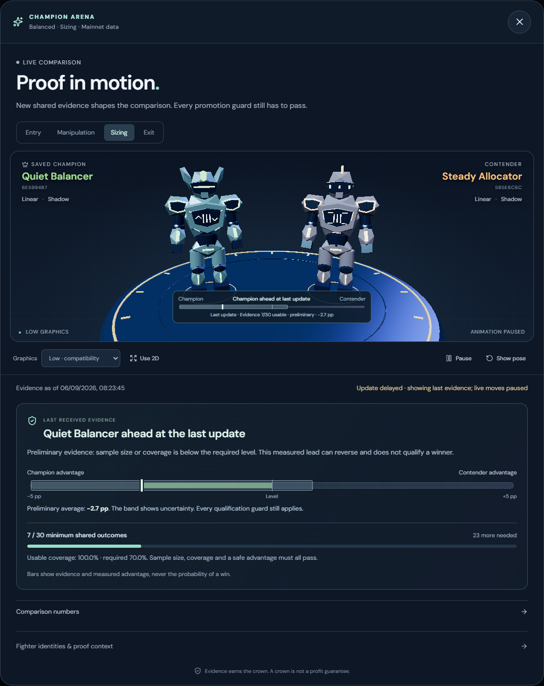

*Captured from the running v1.10.5 paper app on 6 September 2026. The bar shows measured
advantage and uncertainty, not win probability. Live evidence can change after capture.*

Additional views: [Reigning Champions](docs/screenshots/v1.10.5-live-2026-09-06/12-reigning-champions.png),
[recorded battle](docs/screenshots/v1.10.5-live-2026-09-06/13-recorded-battle.png)
and [Entry model profile](docs/screenshots/v1.10.5-live-2026-09-06/16-entry-profile.png).

## Reliability improvements inherited from v1.10.4

<details>
<summary><strong>Season continuity, evidence refresh and preserved safety gates</strong></summary>

- Auto new season finishes through a finite event boundary, even while new market events arrive.
  After the configured verified grace period, unresolved dormant inventory gets one persisted
  five-minute evidence window for the season. Verified losses preserve complete accounting;
  unresolved inventory is archived as unknown and makes the season non-comparable. An active
  position, pending order, Stop, unsafe market data or failed persistence still blocks rollover.
- Learning checkpoints rotate fairly between Policy and Discovery evidence. The optional reserve
  worker validates current on-chain accounts outside the trading decision path. It starts disabled;
  enable `SIGNAL_ARCADE_LEARNING_RESERVE_REFRESH_ENABLED=true` for a staged Shadow rollout after
  checking provider capacity. Defaults allow one batch every 10 seconds, at most 20 routes and
  100 unique accounts. Provider backoff and market pressure can reduce that rate.
- Exit tournament scoring includes every required paired horizon. Training fits a private snapshot
  and publishes only if its season, configuration and authority context still match. Decision Lab
  outcomes require fresh executable reserves and their original fee budget. Dormant holdings alone
  no longer prevent the read-only Coach from running during quiet periods.
- Training models, artifacts and pending candidates commit together, so interrupted writes can retry
  without leaving a partial generation. Mainnet/Demo switches discard parked old-source events;
  cancelling batch collection releases its in-flight accounting.
- Champion history is paged and retained independently of heavy model payloads. Protected current
  and pending artifacts remain available; older payloads may be archived with their audit metadata.
  Status shows the terminal-evidence phase and warns when progress information is delayed.

The 70% executable-outcome requirement, unknown-outcome denominator and activation consent stay
unchanged. The changes improve evidence and reliability; sustained forward results are still needed
to establish useful Champions. They do not establish profitability. A prospective portfolio
experiment remains a separately versioned follow-on, as specified in the improvement plan.

See [Learning Lab](docs/LEARNING.md), [paper execution](docs/PAPER_EXECUTION.md), and the
[v1.10.4 verification record](docs/V1_10_4_VALIDATION.md) for details and rollout limits.

</details>

## 📸 See it in action

These screenshots show the live **v1.10.5** paper app on **6 September 2026**, including its actual
results, fees, learning progress and saved Champion evidence. Figures and warnings were not altered.
Screenshots show the state at capture time, not a performance claim. Earlier version folders are
preserved. The [feature capture record](docs/screenshots/v1.10.5-live-2026-09-06/README.md) documents
the wider tour; the Arena, mobile Arena and receipts use a separate
[post-recovery capture set](docs/screenshots/v1.10.5-quote-recovery-2026-09-06/README.md).

### The Arena

Paper equity, the season-locked risk profile, drawdown policy, unattended continuity, positions
and recent decisions stay together without hiding the assumptions behind the score.

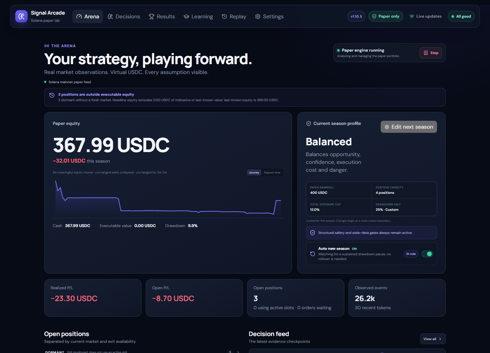

### Season progress

Compare win rate, drawdown, fees and net return across every retained paper season. Modern seasons
freeze their currency, starting bankroll, exact profile and accounting-boundary policy for
like-for-like filters; older history remains clearly labelled without unsupported claims.

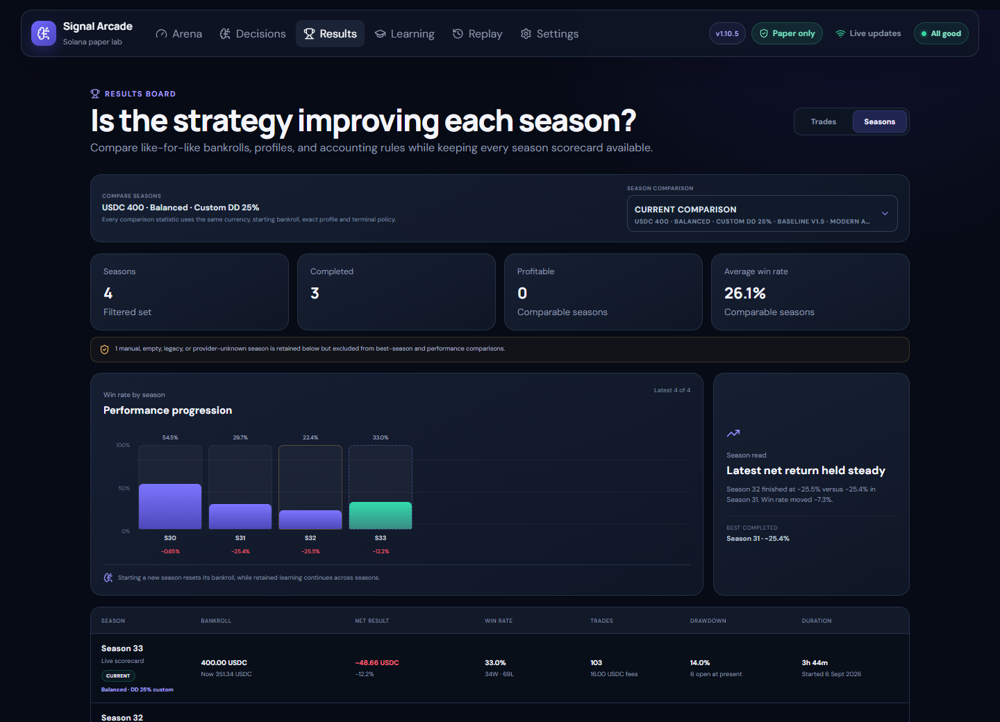

### Learning Lab and AI Coach Room

The deterministic baseline remains in control until the statistical Challenger earns qualification
on later unseen outcomes. Its Entry, Manipulation, Sizing and Exit skills qualify independently,
then compete with their saved champions on common forward evidence. The compact Learning view shows
Entry's exact-cohort Linear/XGBoost progress, current per-skill Champion reigns, and real recorded
battles with their shared sample, coverage and conservative result; detailed proof stays collapsed
until requested. The local AI Coach remains a separate, shadow-only researcher. With explicit
permission, one supported Coach idea may enter the matching Challenger skill as a normal contender;
it never replaces a Champion or trades directly.

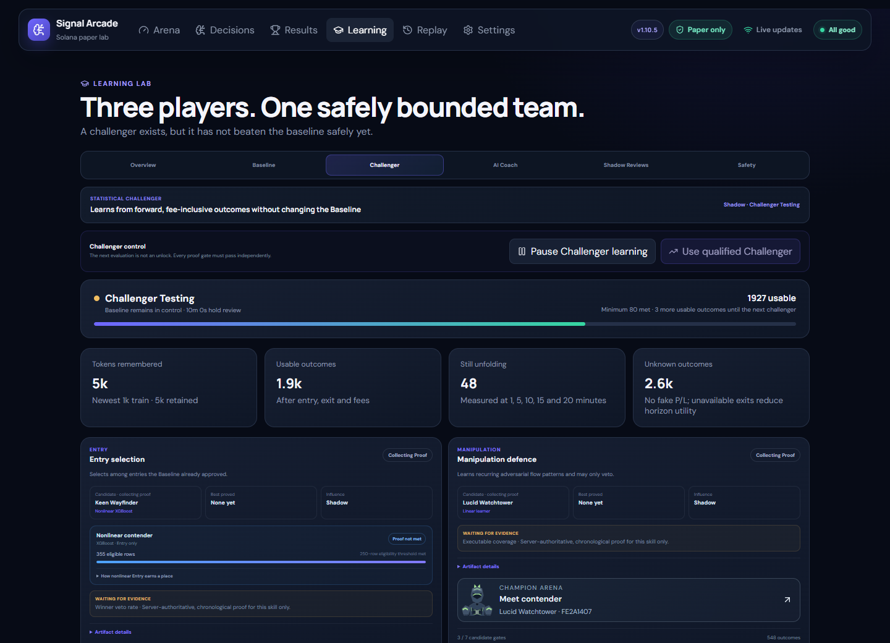

[View the four skill cards and their current proof](docs/screenshots/v1.10.5-live-2026-09-06/10-skill-progress.png).

<details>
<summary><strong>📷 More screenshots</strong></summary>

### Decision board

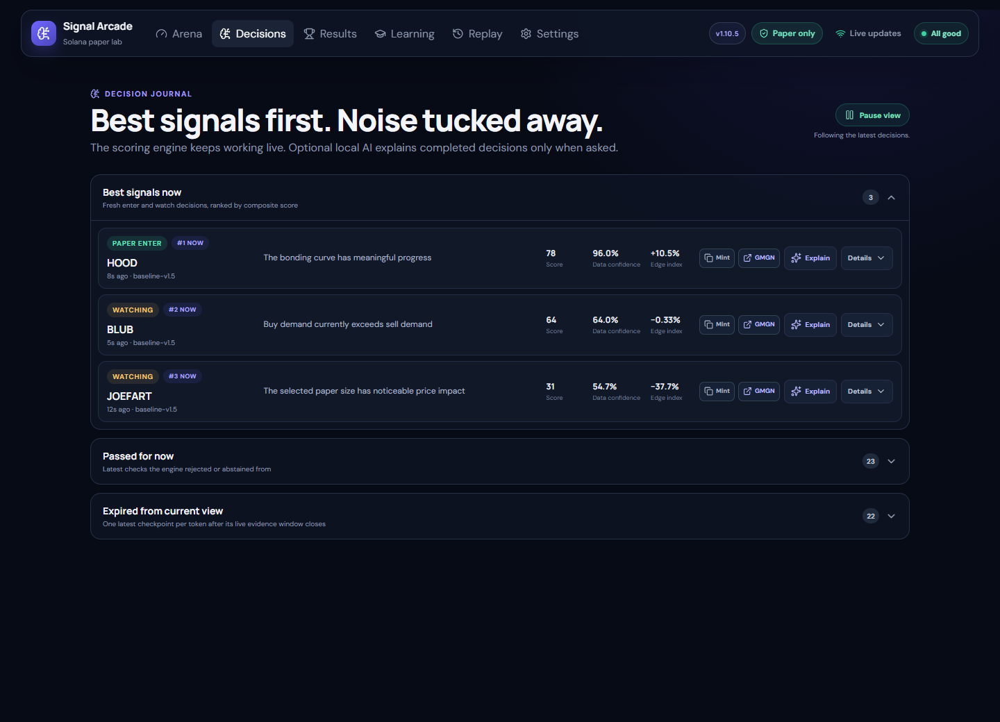

### Replay receipts and modeled friction

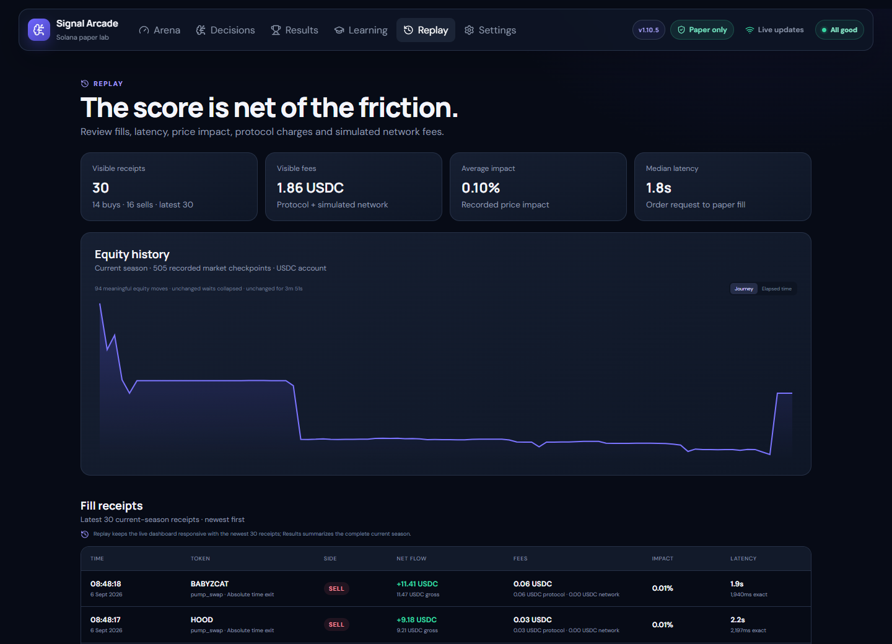

### AI Coach Room

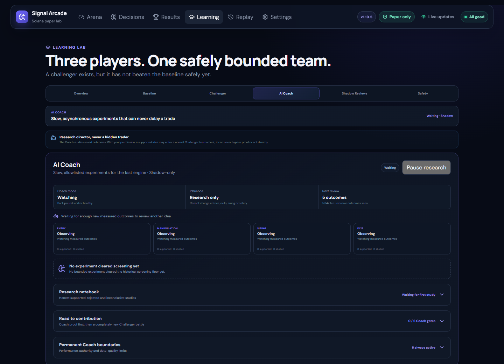

### Provider budgets and pacing

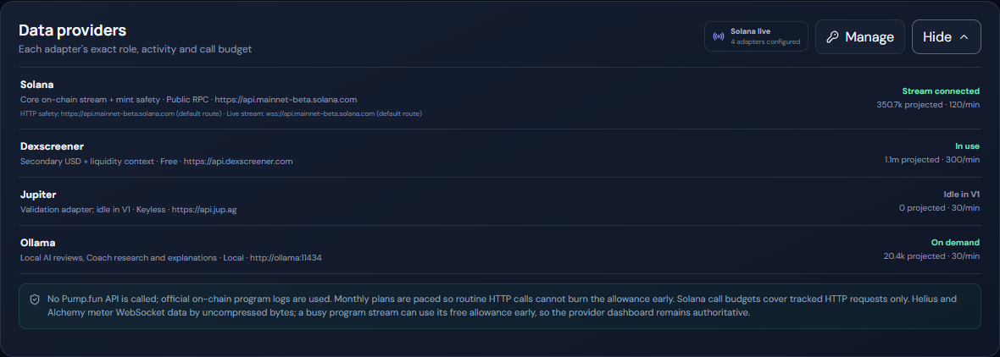

### Optional local AI models

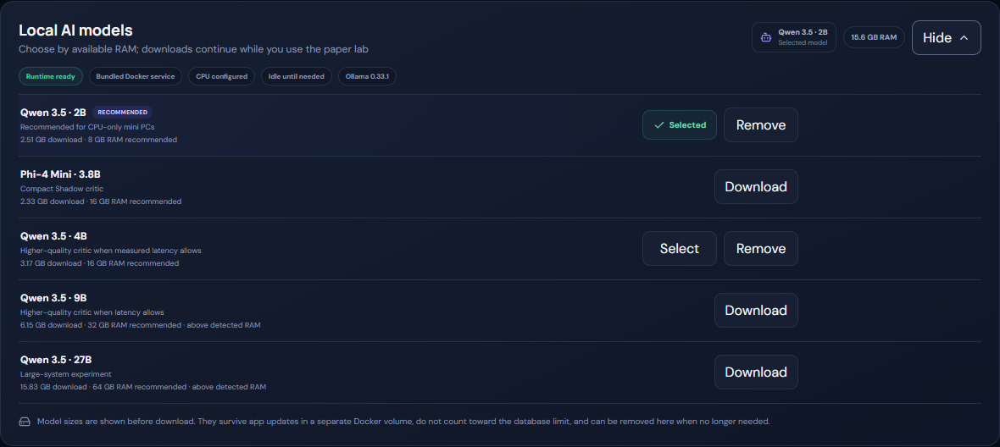

### Bounded diagnostics history

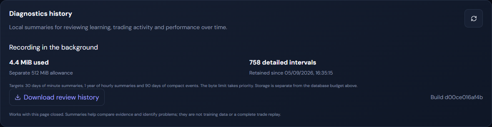

### Mobile layout

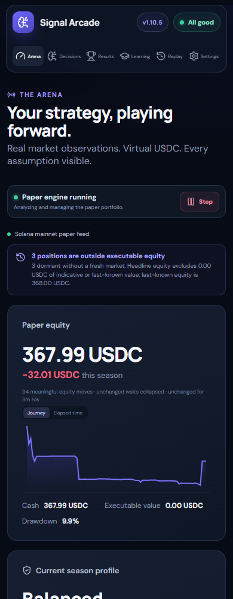

### Mobile Champion battle

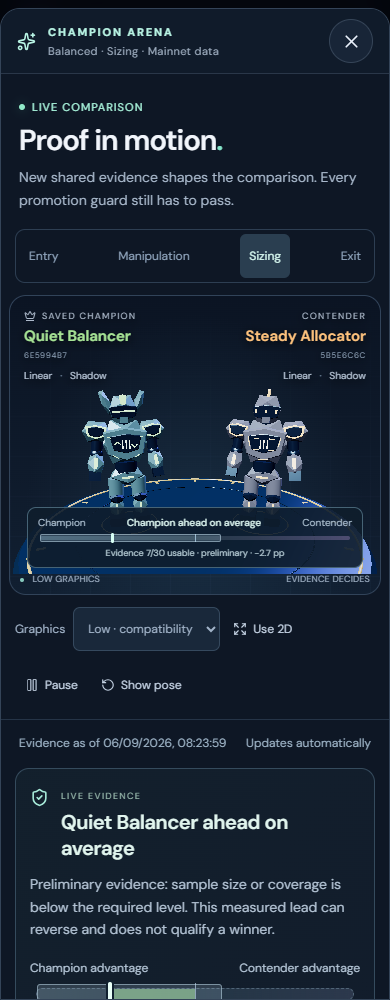

[View the mobile evidence and uncertainty readout](docs/screenshots/v1.10.5-live-2026-09-06/17-mobile-evidence.png).

</details>

---

## ⚡ At a glance

| Player | What it does | Influence in v1.10.5 |
|---|---|---|
| **Fast Baseline** | Scores fresh evidence, distinguishes economically meaningful flow from synthetic-looking activity, and sizes inside hard limits | Runs the paper portfolio |
| **Statistical Challenger** | Learns Entry, Manipulation, Sizing and Exit skills chronologically from fee-inclusive forward outcomes | One explicit consent activates a qualified Entry champion; later skills can join only after independent forward proof and remain monitored |
| **Local AI Coach** | Rotates through bounded Entry, Manipulation, Sizing and Exit studies when the engine is quiet | Research only; a proved idea needs explicit permission and a fresh Challenger tournament before it could ever influence |

- 🛡️ **Corroborated integrity** — Baseline v1.5 combines wallet loops, net flow, coordinated trade
  structure, price-path evidence, economic trade size and meaningful wallet/volume participation
  without calling any one pattern a scam. An uninterrupted venue-local evidence window is
  authoritative: incomplete or shed candidate data waits instead of looking clean, while older
  locked seasons retain their exact policy.
- 🎮 **Comparable paper seasons** — Every new season locks one Safer, Balanced or Aggressive
  profile, a typed drawdown policy, currency and exact virtual bankroll. One next-season editor can
  change them together. Profile changes can finish safely or use a bounded end-now path; manual
  endings remain visible but never become strategy-performance claims.
- 🧠 **Explainable decisions and fills** — Opportunity, danger, confidence, execution, fees,
  impact and latency remain attached to the exact point-in-time evidence used. Every new receipt
  also freezes the precise reserve event and reserve values used by integer paper execution.
- 📚 **Learning must earn trust** — Linear remains the simple default; after enough evidence, a
  fixed single-thread CPU XGBoost Entry contender may compete only when it materially improves
  untouched validation. Each Challenger skill trains and validates chronologically with
  outcome embargoes, then a frozen candidate must beat the saved champion on the same later
  outcomes. Discovery can propose a contender, but only exact-cohort actionable policy episodes
  can qualify it; actual fills remain a separate execution audit. Qualified influence is bounded,
  versioned, auditable and suspended if health degrades.
- 🔎 **Manipulation-aware decisions** — Wallet loops, gross-versus-net flow, trade structure and
  price paths require mature, independently corroborated evidence. A new entry waits for minimum
  integrity coverage, and an extreme isolated warning must resolve before the Baseline acts;
  raw point-in-time measurements remain available to the Challenger and Coach.
- 📐 **Auditable adaptive paper sizing** — Clean mature evidence may use more of realized bankroll,
  while moderate uncertainty receives a smaller exploratory amount, currently suspicious
  candidates are passed over, and cash, exposure, reservations and price impact remain hard limits.
- 🛡️ **Permanent safety boundaries** — A drawdown override changes only the portfolio halt. Stop,
  exposure, stale-data, mint, route and executable-exit protections remain active.
- 🔄 **Built for unattended runs** — Auto season rollover uses 1–24 hours of verified healthy,
  dormant evidence; brief source interruptions pause the clock instead of becoming proof.
- 📊 **Honest throughput status** — Processed, transient, saved, capacity-shed and expired events
  are shown separately, so high-volume in-memory work is not mistaken for lost market data. A
  per-token causal cursor prevents priority scheduling from reversing execution or learning time.
  Storage cleanup runs in small committed chunks, yields to protected market work and avoids
  routine full-journal counts, reducing contention with market processing.
- 🔌 **Keyless and local by default** — Public Solana RPC and DEX Screener work without accounts;
  guided or custom providers and the private Ollama companion are optional. Helius Economy can
  reserve the key for paced HTTP safety lookups while retaining the default live stream.
- 📱 **Responsive and resilient** — Desktop and mobile views use live updates with automatic
  polling fallback, while persistent data and model volumes survive container updates.

---

## 🐳 Quick start with Docker Hub

Only Docker with Compose support and one admin password are required. Provider keys and local AI
models are optional and can be configured later from the web UI.

### 1. Create `.env`

```env
SIGNAL_ARCADE_ADMIN_PASSWORD=replace-this-with-a-long-unique-password
```

### 2. Save this as `docker-compose.yml`

```yaml
services:
  signal-arcade:
    image: nicxx2/signal-arcade:1.10.5
    pull_policy: always
    restart: unless-stopped
    stop_grace_period: 45s
    init: true
    environment:
      SIGNAL_ARCADE_ADMIN_PASSWORD: ${SIGNAL_ARCADE_ADMIN_PASSWORD:?Set a long admin password in .env}
      SIGNAL_ARCADE_OLLAMA_URL: http://ollama:11434
      SIGNAL_ARCADE_OLLAMA_ACCELERATOR: cpu
    extra_hosts:
      - "host.docker.internal:host-gateway"
    ports:
      - "8765:8765"
    volumes:
      - signal-arcade-data:/data
    read_only: true
    tmpfs:
      - /tmp:size=256m,noexec,nosuid
    security_opt:
      - no-new-privileges:true
    cap_drop:
      - ALL
    logging:
      driver: json-file
      options:
        max-size: "10m"
        max-file: "3"

  ollama:
    image: ollama/ollama:0.33.1
    pull_policy: always
    restart: unless-stopped
    init: true
    environment:
      OLLAMA_HOST: 0.0.0.0:11434
      OLLAMA_NO_CLOUD: "1"
      OLLAMA_CONTEXT_LENGTH: "2048"
      OLLAMA_KEEP_ALIVE: 10m
      OLLAMA_MAX_LOADED_MODELS: "1"
      OLLAMA_NUM_PARALLEL: "1"
      OLLAMA_MAX_QUEUE: "4"
      LLAMA_ARG_CACHE_RAM: "512"
      CUDA_VISIBLE_DEVICES: "-1"
      ROCR_VISIBLE_DEVICES: "-1"
    expose:
      - "11434"
    volumes:
      - signal-arcade-models:/root/.ollama
    security_opt:
      - no-new-privileges:true
    cap_drop:
      - ALL
    healthcheck:
      test: ["CMD", "ollama", "list"]
      interval: 30s
      timeout: 10s
      start_period: 20s
      retries: 5
    logging:
      driver: json-file
      options:
        max-size: "10m"
        max-file: "3"

volumes:
  signal-arcade-data:
  signal-arcade-models:
```

### 3. Start it

```bash
docker compose up -d
```

Open `http://localhost:8765`, or `http://server-ip:8765` from another device on your LAN. Use any
username and the password from `.env`.

On first use:

1. Choose a virtual SOL or USDC bankroll in **Arena**.
2. Select **Safer**, **Balanced** or **Aggressive**.
3. Press **Start paper engine**.
4. Optionally choose a local model under **Settings → Local AI models**.

### Updating

In **Settings → Maintenance & updates**, choose **Prepare for upgrade** and wait for **Ready**.
Signal Arcade finishes its current atomic paper action, preserves open positions and learning, and
shows the same commands below. It deliberately does not mount the Docker socket or control the host.

Change the image tag in `docker-compose.yml` to the newer published release, then run in that file's
folder:

```bash
docker compose pull
docker compose up -d
```

The named data and model volumes survive container updates. The prior paper-engine state resumes
after startup health checks, while an automatic-season countdown continues with its remaining time
rather than treating update downtime as market evidence. If preparation cannot finish, it restores
normal operation and reports the reason. Users who deliberately prefer a rolling tag can use
`nicxx2/signal-arcade:latest` instead.

Upgrading from v1.9.2 or any earlier v1.10 release to v1.10.5 preserves the existing bankroll, open
positions, pending-order accounting, seasons, settings, evidence and Champion history in the
same data volume. The Baseline stays on v1.5, so an in-progress season keeps its trading policy.
Earlier Challenger artifacts remain preserved for audit but cannot silently gain
`challenger-features-v5` authority; the upgraded Challenger safely collects causally ordered
evidence in Shadow until a current Champion earns every qualification and common-forward gate.
The v1.10.2 chronology fix and v1.10.3 performance patch reset no learning cohort and require no
new paper season. Restart recovery remains ordered by Solana slot, accepted held-position account
snapshots still fence older queued rows, and every fill keeps its exact RPC reserve provenance.
Routine storage cleanup now uses bounded transactions and fast page-capacity checks; it never
deletes fills, ledger entries, seasons or learning proof merely to satisfy a configured target.
If the upgrade finds an impossible timestamp in the retained current-season fills, it preserves
and labels that season,
stops the paper engine, excludes the result from ranking and learning, and asks for a clean new
season instead of rewriting history.

v1.10.4 introduces schema 14 and imports Champion history into an indexed, paged journal.
It preserves existing bankrolls, custom drawdown settings, positions and learning records. Exit
Champions promoted under the older scoring proof must requalify before regaining authority;
their history remains visible. Decision Lab uses `ai-critic-schema-v5` for newly measured proof.

Moving from v1.10.4 to v1.10.5 adds no migration or learning reset. Keep the validated v1.10.4 image
available for an application rollback against schema 14. The arena's graphics preferences are
browser-local and never enter the server's learning or season fingerprints.

Database migrations are forward-only. Before upgrading, keep a consistent SQLite backup or a
snapshot of the complete stopped data volume. A v1.10.3 image cannot open schema 14: rollback
requires restoring the matching pre-upgrade data and image together. Never copy only a running
SQLite database file while leaving its WAL behind.

> Portainer users can paste the same Compose file into the Web editor and define
> `SIGNAL_ARCADE_ADMIN_PASSWORD` as a stack environment variable.

[Open the Docker Hub repository →](https://hub.docker.com/r/nicxx2/signal-arcade)

---

## 🧭 How the decision system works

```text
Official Solana program events
          ↓
Point-in-time feature snapshots
          ↓
Fast deterministic decision + structural gates
          ↓
Latency, fees and impact-aware paper execution
          ↓
Measured 1 / 5 / 10 / 15 / 20 minute outcomes
          ↓
Chronological challenger validation and AI Shadow coaching
```

The main engine does not wait for AI. It scores only saved market evidence and abstains when the
required route, mint state, reserves, conversion or freshness is unknown. Pending orders reserve
cash and position capacity before filling, and open positions remain supervised even during a
candidate burst.

Exits are deterministic too: stop loss, creator/mint safety, migration state, trailing profit,
signal deterioration and an absolute time ceiling remain bounded and visible. Strong fresh
evidence may extend a winner past its normal review point, but it cannot remove those hard gates.

<details>
<summary><strong>📚 Learning safeguards</strong></summary>

- Outcomes are measured after the decision at 1, 5, 10, 15 and 20 minutes.
- Fees, impact and exit availability are included; missing exits never become fake zero P/L.
- Entry, Manipulation, Sizing and Exit are independent versioned skills; one weak skill cannot earn
  another skill's permission.
- Training and validation remain chronological with embargoes to reduce look-ahead leakage.
- A candidate and current champion are frozen before a common-forward tournament; small, lucky or
  survivor-only cohorts cannot replace the champion.
- The Learning Lab durably keeps every recorded Champion milestone and referenced artifact while
  showing only a compact recent view; historical Champions remain valid without invented
  promotions or profit claims.
- One explicit activation grants consent to the qualified Entry champion. Later qualified skills
  auto-join only after proving value beside the active upstream ensemble.
- Active skills continue monitoring later unseen outcomes. A degraded or unverifiable skill and
  every dependent downstream skill are suspended without weakening the Baseline.
- Unfinished forward horizons remain pending rather than counting as unavailable, and every
  retraining trigger stays inside the exact personality/configuration cohort that produced it.
- Champion proof and active-skill health use the authoritative Policy journal, so a later real
  entry after an earlier PASS remains valid without manufacturing another Discovery sample. Only
  one exact-cohort Policy trajectory per mint may contribute, and its Discovery twin is excluded
  from fitting so training and qualification evidence stay disjoint.
- Fitting runs only through one coalesced quiet-time worker; outcome safety, Champion health and
  common-forward tournament accounting remain immediate.
- Nonlinear artifacts use portable JSON with a bounded size and SHA-256 verification. Linear wins
  marginal family comparisons, and neither training order nor a missing/corrupt payload can create
  a Champion or influence.
- A proved Sizing multiplier applies only when that exact amount still fits all deterministic cash,
  exposure, reservation and route-impact limits; otherwise the valid Baseline size is preserved.
- Demo tokens can never train or activate the live-paper learner.
- Learning history persists across paper seasons and remains separated by risk personality.
- Default, custom and disabled drawdown experiments keep distinct season scorecards while sharing
  the same personality learning lineage; blocked opportunities are still recorded as
  non-actionable and cannot inflate Challenger proof.

See the full [Learning specification](https://github.com/Nicxx2/signal-arcade/blob/main/docs/LEARNING.md).

</details>

---

## 🤖 Local AI: optional, private and asynchronous

The bundled Ollama service is not published to the host or LAN. The default `qwen3.5:2b` model is
CPU-friendly, but no model is downloaded automatically. Signal Arcade remains fully functional
without Ollama.

- **Off** — no AI calls.
- **Shadow** — the local model reviews completed baseline candidates but has no influence.
- **Qualified Coach** — reserved for a future gated update after Shadow proves useful on forward,
  fee-inclusive evidence across independent seasons.
- **Live Critic** — remains a future stage and cannot be enabled in this release.

The AI Coach Room is a separate research workflow and can be paused without disabling saved Shadow
decision reviews. It runs only when trading work is quiet. Deterministic code creates a small
allowlist across Entry, Manipulation, Sizing and Exit; the model may select one candidate or none.
Historical evidence can reject or propose an idea, but only exact-cohort outcomes recorded after
that proposal can support it. The proof clock survives pruning and restart, while incompatible
Baseline, feature-schema, personality, provider/fee or active-Challenger contexts never mix.

A bounded study needs at least 60 usable forward outcomes, at least 70% executable coverage, two
independent seasons with at least ten usable outcomes each, and a confidence-adjusted improvement
above one percentage point. It closes honestly as rejected or inconclusive instead of collecting
forever. A supported idea still has zero direct authority. If the user explicitly allows
contribution, it waits for an existing statistical Champion in the matching skill, becomes only a
new contender, and must win a fresh common-forward tournament before the Challenger can promote it.

<details>
<summary><strong>⚡ Optional GPU acceleration</strong></summary>

CPU inference is the portable default. GPU access must be granted by Docker; changing an
environment label alone is not enough.

Download the matching overlay beside your Compose file:

- [NVIDIA overlay](https://raw.githubusercontent.com/Nicxx2/signal-arcade/main/compose.nvidia.yaml) — Linux or Docker Desktop/WSL2 with supported NVIDIA drivers/toolkit.
- [AMD ROCm overlay](https://raw.githubusercontent.com/Nicxx2/signal-arcade/main/compose.amd.yaml) — supported AMD GPUs on Linux.

Then start with both files:

```bash
# NVIDIA
docker compose -f docker-compose.yml -f compose.nvidia.yaml up -d

# AMD ROCm on Linux
docker compose -f docker-compose.yml -f compose.amd.yaml up -d
```

Settings reports runtime availability, the configured accelerator and actual CPU, GPU or hybrid
inference based on Ollama's loaded-model VRAM use. Models and learning data are preserved when
switching compute modes. macOS Docker and unsupported integrated GPUs remain CPU-only.

</details>

---

## 🔌 Data providers

The baseline requires no API key:

| Provider | Role | Default |
|---|---|---|
| Solana RPC | Official Pump/PumpSwap logs and mint safety | Public, keyless |
| DEX Screener | Separately timestamped USD/liquidity context | Keyless |
| Jupiter | Optional validation adapter; idle in V1 fills | Keyless configuration |
| Ollama | Explanations and Shadow coaching | Local and optional |

Under **Settings → Data providers**, users can select guided Helius, Alchemy or SolanaTracker RPC
presets, or enter custom HTTP/WebSocket endpoints and explicit free/paid limits. Keys are
write-only and never returned to the browser. **Helius Economy** uses keyed Helius HTTP for paced
mint/route safety lookups but restores the configured environment/public WebSocket for the
high-volume stream; the UI shows both routes and whether either is saved or default.

Monthly tracked-call caps are paced across the month, routine calls retain a reserve, and provider
`429 Retry-After` responses are honored. WebSocket bandwidth and provider-specific credits/CUs
remain visible only in the provider's own dashboard, so that dashboard is authoritative for paid
usage.

> For safety, secret values can be submitted only through `localhost` or HTTPS. A plain LAN URL can
> use every non-secret control, but provider keys should be added on the Docker host or through an
> HTTPS reverse proxy.

[Read the provider truth table →](https://github.com/Nicxx2/signal-arcade/blob/main/docs/PROVIDER_MATRIX.md)

---

## 🛡️ Paper-only boundary

V1 contains no wallet-key input, seed phrase handling, transaction signing or transaction
broadcasting path. Paper mode is not a visual label over live execution—it is the application
boundary.

Signal Arcade also:

- rejects a non-loopback native bind unless an admin password is configured;
- same-origin checks browser state changes;
- requires explicit confirmation for destructive season resets;
- stores provider secrets server-side and never sends their values back to the UI;
- fails closed on stale data, unverified migration routes, unsupported quote assets and unsafe or
  unknown mint structures;
- keeps storage, Docker logs, market-event retention and AI work bounded for long-running hosts.

---

## 🛠️ Build from source

<details>
<summary><strong>Docker source build</strong></summary>

```bash
git clone https://github.com/Nicxx2/signal-arcade.git
cd signal-arcade
cp .env.example .env
# Set SIGNAL_ARCADE_ADMIN_PASSWORD in .env
docker compose up --build -d
```

The repository's `compose.yaml` builds locally. The README quick-start stack and
`compose.image.yaml` pull the published Docker Hub image instead.

</details>

<details>
<summary><strong>Native development setup</strong></summary>

Requirements: Python 3.12+, Node.js 24+ and pnpm 11.

```bash
corepack enable
pnpm install --frozen-lockfile
pnpm --filter signal-arcade-web build

python -m venv .venv
# Windows: .venv\Scripts\activate
# Linux/macOS: source .venv/bin/activate
python -m pip install -e ".[dev]"

cp .env.example .env
signal-arcade
```

Open `http://127.0.0.1:8765`.

</details>

---

## ✅ Verification

```bash
python -m pytest
python -m ruff check backend tests
python -m ruff format --check backend tests
mypy backend/signal_arcade
pip-audit .
pnpm --filter signal-arcade-web lint
pnpm --filter signal-arcade-web test
pnpm --filter signal-arcade-web build
```

Technical documentation:

- [Architecture](https://github.com/Nicxx2/signal-arcade/blob/main/docs/ARCHITECTURE.md)
- [Decision model](https://github.com/Nicxx2/signal-arcade/blob/main/docs/DECISION_MODEL.md)
- [Learning](https://github.com/Nicxx2/signal-arcade/blob/main/docs/LEARNING.md)
- [Paper execution](https://github.com/Nicxx2/signal-arcade/blob/main/docs/PAPER_EXECUTION.md)
- [Changelog](https://github.com/Nicxx2/signal-arcade/blob/main/CHANGELOG.md)

---

## ⚠️ Important limitations

- Paper results are not evidence that a strategy will be profitable live.
- Latency, MEV, failed transactions, RPC gaps and adversarial tokens can be worse than any paper
  model.
- V1 simulates native-SOL Pump curves and wrapped-SOL PumpSwap markets. USDC is an optional
  portfolio accounting currency, not support for USDC-quoted pools.
- Public RPC endpoints can throttle, disconnect or miss events; a private RPC can improve
  reliability but cannot promise uninterrupted coverage.
- Token-2022 mints with transfer-affecting or unreviewed extensions fail closed.
- Live trading belongs in a separately reviewed V2 and must not be introduced by weakening V1's
  paper-only boundary.

---

## 🤝 Community

Issues and pull requests are welcome. Please read the
[contribution guide](https://github.com/Nicxx2/signal-arcade/blob/main/CONTRIBUTING.md) and
[security policy](https://github.com/Nicxx2/signal-arcade/blob/main/SECURITY.md) first.

Signal Arcade is released under the [MIT License](https://github.com/Nicxx2/signal-arcade/blob/main/LICENSE).

*Paper-trading education only. Saved explanations and local AI experiments do not alter historical scores or constitute financial advice.*
