# 🧠 Signal Arcade v1.10.11

**A local-first Solana paper-trading lab where every decision leaves evidence.**

Signal Arcade watches official Pump and PumpSwap program events, ranks opportunities with a fast
deterministic engine, simulates fee-aware paper fills, and learns from what happened afterward.
An optional local AI coach observes the same saved outcomes outside the trading decision path.
No wallet keys, live orders, paid provider or cloud AI are required.

[](https://github.com/Nicxx2/signal-arcade/releases)
[](https://github.com/Nicxx2/signal-arcade)
[](https://hub.docker.com/r/nicxx2/signal-arcade)
[](https://github.com/Nicxx2/signal-arcade/blob/main/LICENSE)

⭐ If Signal Arcade is useful or interesting to you, consider starring the repository.

> Signal Arcade is a paper simulator—not a wallet, signal-selling service, or promise of profit.

---

## What changed in v1.10.11

**Release status (25 September):** local regression and upgrade checks passed. The completed
six-hour live review preserved all 119 observed training/proof publication groups and reduced
retention debt overall, but burst expiry, diagnostic gaps and uneven cleanup recovery still
exceeded parts of the runtime acceptance criteria. Use this version with monitoring;
weeks or months of unattended reliability have **not** been established. See the
[six-hour review and remaining limits](docs/V1_10_11_VALIDATION.md#six-hour-runtime-and-source-publication-review--25-september-2026).

- **Fairer market processing and catch-up work:** the market worker yields between complete
  events after a short processing slice, preserving committed persistence, urgent-work priority
  and season boundaries. History cleanup can proceed independently of an unavailable capacity
  reading, and indexed decision retention avoids repeated selection work. Training workspace
  release and response-local population reuse reduce avoidable background work. Learning,
  trading, proof and provider rules remain unchanged. The final local comparison passed its
  latency/retention gates; sustained live recovery remains a separate acceptance requirement.
  See the [final scheduling checks](docs/V1_10_11_VALIDATION.md#final-cooperative-scheduling-validation--24-september-2026).
- **Clearer storage status and safer saves:** the storage card shows separate capacity/history
  measurement ages and reports overdue history without assuming cleanup is catching up.
  The live-data budget is a cleanup target, not a hard limit on the database file or WAL.
  Current browser saves detect conflicting edits, preserve drafts and distinguish an acknowledged
  save from an interrupted request. This local polish is validated separately from runtime
  retention recovery; see the [storage checks](docs/V1_10_11_VALIDATION.md#storage-status-and-save-safety--24-september-2026).
- **Less repeated SQLite work:** budget cleanup skips the second retained-cohort scan when
  an old chunk is strictly before the protected boundary, keeping exact timestamp ties and
  protected records intact. Large event batches use bounded multi-row statements inside the
  same atomic transaction. Maintenance diagnostics distinguish admission, setup, read work and
  restoration from worker dispatch/resumption. These changes were **deployed locally through
  Settings preparation on 24 September**; sustained burst/retention recovery and runtime
  acceptance remain pending. See the
  [rollout checks](docs/V1_10_11_VALIDATION.md#sqlite-work-reduction-rollout--24-september-2026).
- **Assessment saves and retention attribution:** optional AI assessment writes run on joined
  workers, with committed outcomes registered before cancellation or an upgrade can finish.
  Same-token outcome ticks wait for that registration; queued and prefetched ticks receive
  their current priority before newer ticks can overtake them. Cleanup separates SQL execution from
  transaction exit, so slow fixed commit overhead alone does not shrink its chunks toward one
  row; growth still requires a fast complete transaction. Bounded timings distinguish worker
  execution from event-loop resumption. These preserve existing evidence and authority rules;
  this candidate was **deployed locally through Settings preparation on 24 September**.
  Sustained runtime acceptance remains pending; see the
  [rollout checks](docs/V1_10_11_VALIDATION.md#assessment-handoff-live-rollout--24-september-2026).
- **Bounded optional housekeeping:** resolved incident and AI-audit cleanup now uses small,
  cancellable transactions with an original deadline that includes dispatch and lock waits.
  Paced retries rotate categories without rerunning settled primary cleanup; unresolved records
  and retained evidence stay protected. Optional retries yield to in-flight learning requests.
  A resolved-incident index avoids repeated backlog sorting.
  Diagnostics distinguish actual writer waits from collector admission without loosening either
  guard. These are reliability changes; sustained runtime acceptance remains required.
- **Less repeated processing work:** fresh ledger reads use a covering account index, and
  each entry assessment reuses its own cash valuation. Feature validation keeps the same
  fields, short-circuit order and proof decisions with less traversal overhead. Compact token
  views construct only displayed values while preserving rolling calculations and cache behavior.
  Cleanup reads related page counters in one statement. Bounded candidate/governance timings
  help attribute remaining pressure. Trading rules, Champion checks, coverage requirements and
  training windows are unchanged; isolated savings do not certify sustained burst recovery.
- **Delayed-response safety:** enrichment preparation and completed metadata/route replies use
  joined workers under the market boundary, with provider calls outside it. Replies cannot cross
  an engine, token, source or requested-pool change, overwrite newer route verification, or change
  a replacement token's retry state. Maintenance reads recheck cancellation and the original
  deadline after setup. Bounded diagnostics distinguish candidate/enrichment CPU from dispatch,
  worker elapsed and event-loop resumption. These fixes preserve trading and learning rules;
  sustained burst and retention acceptance still require runtime evidence.
- **Evidence reads and pressure diagnostics:** broker evidence readers use indexed decision/fill
  references while preserving chronological and duplicate selection. Cleanup rechecks its original
  deadline after connection setup; additional timings separate setup/restoration and worker CPU
  from elapsed SQL/commit time. When detailed diagnostics are delayed, a bounded reduced capture
  can retain pipeline counters and complete publication groups without database I/O. Writer
  pressure guards remain unchanged; reduced detail and remaining gaps stay explicit. Retention
  samples retain their actual measurement timestamps. See the
  [final reliability checks and limits](docs/V1_10_11_VALIDATION.md#final-evidence-and-continuity-review--23-september-2026).
- **Community presentation and cleanup polish:** the actual-entry disclosure
  stays inside Champion impact, and Results shows loading/retry feedback beside the selected
  sort while identifying the order of any retained rows. Bounded history cleanup rotates the
  first category so a slow raw-trade query cannot always exclude old non-entry decisions and
  equity samples. Per-category diagnostics preserve the existing deadlines and record limits.
  Maintenance reader admission also yields at its deadline; optional counts offer cancellation
  during their scan and run after core cleanup, when market pressure allows. Unavailable capacity
  stays explicitly unknown, and retained measurements keep their actual ages. Saved dashboard
  age includes assembly time. Deployed locally through Settings preparation on 21 September;
  sustained burst recovery, diagnostic continuity and retention catch-up remain under observation.
  The fixed Manipulation study remains separate research
  and does not authorize a trading change. See the
  [rollout checks](docs/V1_10_11_VALIDATION.md#maintenance-polish-live-rollout--21-september-2026)
  and [final source review and remaining limits](docs/V1_10_11_VALIDATION.md#final-community-readiness-review--21-september-2026).
- **Champion selectivity follow-up:** passive reporting separates original
  supported entries/vetoes from actual Baseline fallback fills and their matched results. A
  bounded RPC handoff can preserve a fetched learning batch across a brief storage chunk while
  retaining all freshness and priority guards. A separate offline shadow screen compares a
  fixed Manipulation hypothesis with incumbent, Baseline and cash; trading changes remain
  conditional on fresh evidence. The engineering changes were deployed locally through Settings
  preparation on 21 September; sustained performance remains under observation. The completed
  fixed-window study did not support activating its candidate rule. See
  [study boundaries and results](docs/SUPPORT_EVALUATION.md).
- **Release reliability follow-up:** completed bounded cleanup passes
  keep their catch-up cadence when only optional housekeeping yields to market traffic. HTTP 413
  responses use an already configured provider fallback and bounded backoff. Baseline size,
  evaluation and entry-permission preparation share one joined worker dispatch, preserving the
  same checks and original measurement clocks. Deployed locally through Settings preparation on
  21 September; sustained burst and retention improvement still need normal-traffic validation.
  See the [rollout checks](docs/V1_10_11_VALIDATION.md#release-reliability-live-rollout--21-september-2026).
- **Durable enrollment activity evidence:** compact
  records preserve each newly enrolled Discovery/Policy opportunity's original activity and
  integrity assessment through decision-history cleanup. They stay outside model inputs and
  never change buying, exits or Champion permissions. A bounded offline research report can
  compare future matched outcomes; buying changes still require prospective evidence. See
  [capture and research limits](docs/ACTIVITY_EVALUATION.md#durable-enrollment-evidence).
  The research reader extracts a bounded private study period without copying the whole
  database, preserves first-opportunity identities and reports missing evidence explicitly.
  Enrollment capture was deployed locally through Settings preparation on 20 September;
  the standalone reader runs separately. The first six-hour prospective study completed with
  insufficient fresh inputs and zero pattern matches: **inconclusive**, with no buying-rule
  activation. See the [completed study and limits](docs/ACTIVITY_EVALUATION.md#first-prospective-study-result).
- **Clearer saved entry evidence:** skill receipts explain an applied veto versus an
  unsupported proposal, record the first failing support feature when available, and link later
  attempts to the original independent Policy opportunity. Decision evidence ages use the original
  measurement and decision clocks. This follow-up was deployed locally on **21 September**;
  the completed study retains its original archived evaluator and unchanged buying rules.
- **Bounded dashboard action reads:** ENTER/WATCH history uses an action/time index and a
  bounded merge, retaining timestamp ties and season isolation. Optional diagnostics separate
  token assembly from decision reads. Dashboard evidence age includes assembly time.
- **Trade count and value evidence:** new saved decision details distinguish buy-count share
  from buy-volume share, signed net flow and trades/wallets meeting a descriptive 0.01 SOL
  cutoff. Missing evidence stays unknown. These additional measurements do not change scores,
  model inputs or Champion requirements. Position percentages are labelled **hold score**,
  not profit odds. See the [evaluation boundary](docs/ACTIVITY_EVALUATION.md).
  Deployed locally through Settings preparation on 20 September; see the
  [rollout checks and limits](docs/V1_10_11_VALIDATION.md#activity-evidence-live-rollout--20-september-2026).
  Longer normal-traffic validation remains necessary.
- **Provider recovery and clearer collection diagnostics:** the latest local follow-up isolates
  in-flight RPC results from provider settings changes and resets ordinary reconnect backoff
  after acknowledged, stable stream activity. Bounded reports distinguish HTTP, transport and
  protocol failures without saving provider text or URLs, and show selected/unselected deadline
  bands. Learning gates, batch limits and scheduling are unchanged. This follow-up was **deployed
  locally through Settings preparation on 19 September**; see [rollout checks and remaining limits](docs/V1_10_11_VALIDATION.md#provider-recovery-live-rollout--19-september-2026).
- **Clearer saved learning evidence:** each Entry family lists its coverage-freshness check
  once. Expanded artifact details distinguish actual training, validation and chronology counts,
  saved evidence periods and the validation boundary. Sizing, contextual Exit and Coach keep
  their different population meanings; unavailable historical details stay unavailable.
  The Entry window remains at most 1,000 eligible resolved observations, not 1,000 fitted rows;
  see [training-window and saved-evidence details](docs/LEARNING.md#retention-training-windows-and-saved-evidence).
  Optional diagnostic losses now identify a fixed set of event types within the existing
  limits. Deployed locally through Settings preparation on 19 September; community publication
  remains pending. See [validation and rollout limits](docs/V1_10_11_VALIDATION.md#community-presentation-and-diagnostic-polish--19-september-2026).
- **Optional learning coverage requirement:** Settings → Learning requirements offers **70%
  (default), 65%, 60% or 55%** for native Entry (Linear/XGBoost), Manipulation, Sizing and Exit.
  Lower values accept less complete evidence; they do not improve measured coverage, accuracy or
  profit. Other proof, sample and permission checks still apply. Existing generations retain
  their recorded requirement and new generations need validation after the setting change.
  Coach-derived support stays at 70%. See [scope and transition rules](docs/LEARNING.md#configurable-skill-coverage-v11011).
  The original 70/65/60 choices were deployed locally through Settings preparation on 19 September;
  that initial rollout preserved 70%. The **55% extension was deployed locally on 20 September**,
  preserving the existing 60% selection; 55% was not selected during the upgrade.
  It also applies to eligible new native health/recovery proof, subject to stricter saved requirements.
  See the [55% checks and evaluation limits](docs/V1_10_11_VALIDATION.md#optional-55-coverage--20-september-2026).
- **Recovery after a drained burst:** historical lag no longer blocks diagnostics indefinitely
  once all admitted market work has drained. Local training/publication can recover after five
  quiet seconds following a successful batch, with pressure, job-validity and priority checks
  still applied. RPC freshness and qualification gates are unchanged.
- **More useful slow-work evidence:** bounded collector deferral counters and coherent samples
  connect a slow storage, heartbeat or event-persistence operation with its own phase timings.
  Optional reporting retains existing limits and yields to saved learning/proof reports.
- **Replayable new fill fees:** new paper receipts retain optional fee-rounding provenance for
  an arithmetic audit. Fill formulas and balances are unchanged; older receipts remain readable
  and missing provenance is reported as unavailable.
- **Bounded position-probe retention:** existing heartbeat and watchdog passes remove probes
  for closed or replaced holdings. Current-position proof and saved terminal evidence remain
  intact. A late request for an old position cannot overwrite a new holding's probe in the
  same mint. This reduces unnecessary retained data and dashboard payload growth.
- **More precise performance diagnostics:** bounded cumulative detail separates dashboard
  portfolio, history, learning, advisory and remaining assembly work, plus collection request,
  lock-wait and apply time. Post-fetch discard reasons identify the fetched batches within
  aggregate guard deferrals.
  Detail yields to proof events and uses the existing byte and retention limits.
- **Better diagnostics under pressure:** a bounded backlog keeps up to four publication report
  groups through short collection delays. Original report times and group membership survive;
  each saved interval still contains at most eight events. Pending reports are visible separately
  from writer handoff, and overload, malformed reports and writer losses remain explicit.
  Collection yields to market pressure and never grants a model permission to act.
- **Collection selection visibility:** sampled lane/horizon counts distinguish eligible work,
  fresh cached routes, excluded identities, missing state and already-expired windows. Unique
  route counts and remaining-deadline bands help investigate capacity without changing selection.
  Unclassifiable clocks on already-excluded records are reported separately without interrupting
  normal selection.
- **More useful local-work attribution:** optional worker timings separate broker valuation,
  assessment and persistence; decision serialization, lock, SQL and commit work; and collection
  validation, checkpoint persistence and governance. Timing is observational and does not change
  outcomes, model gates or order execution. See [measurement limits](docs/DIAGNOSTICS_HISTORY.md).
  Bounded equity detail and a coherent slow-broker sample distinguish portfolio reads, equity
  writes and commit waits without adding database reads or changing execution.
- **Bounded cleanup coordination:** routine cleanup briefly yields to an admitted learning
  request when a recent capacity check permits it. Urgent or unknown storage pressure still
  proceeds. History categories adjust their own bounded chunks, so an expensive equity or
  decision query cannot shrink fast raw-event cleanup. Maintenance SQLite contention yields
  without changing ordinary trading timeouts, and dispatch waits consume the original deadline.
  Budget cleanup alternates raw/decision work and uses indexed raw retention boundaries while
  preserving exact timestamp ties, protected evidence and post-fetch validation. Sustained
  catch-up and burst performance still require live observation.
- **Dashboard refresh continuity:** an expired cached view queues one shared refresh through
  storage activity. Waiting does not hold the market lock; stale responses retain their real
  timestamp. Additional assembly timing supports further investigation without caching authority.
- **Clearer coverage wording:** the default 70% means usable outcome coverage, not accuracy or win rate.
  Operational coverage and a fitted model's coverage can differ. Qualification still requires
  every applicable performance check, and a Champion needs separate permission and activation proof.
- **Fitted-cohort explanations:** new Entry Linear/XGBoost and Manipulation
  artifacts retain small counts for usable outcomes, recorded quote failures and missing
  checkpoints. Entry's family panels explain their own saved generation; older or inconsistent
  reports remain unavailable. These counts do not change fitting, payloads or proof gates.
- **Indexed order evidence:** a non-unique decision lookup index avoids
  scanning Policy JSON for each order update. Order and evidence linkage still commit together;
  diagnostics separate lookup time from writer-lock admission.
- **Less unnecessary proof sorting:** Policy selection filters ineligible records before sorting
  the remaining evidence. Chronology, identity reservations, missing/negative outcomes and
  immediate Champion health checks are preserved.
- **Conservative collection changes:** scheduling priorities, batch defaults, fixed deadlines,
  real quote failures and post-fetch safety guards are preserved. Larger existing batch options
  are tested at slow-response and exact-deadline boundaries; this is not a live coverage forecast.

The subsequent burst follow-up was **deployed locally through Settings preparation on 19 September**.
Optional diagnostic cadence now follows collection rather than queue admission, slow market-batch and dashboard
samples retain coherent timings, and future-only Local AI outcome work avoids unnecessary
executor calls while preserving cooperative scheduling. See the
[staged checks and limits](docs/V1_10_11_VALIDATION.md#burst-diagnostics-and-ai-dispatch-follow-up--19-september-2026)
and [live rollout checks](docs/V1_10_11_VALIDATION.md#burst-follow-up-live-rollout--19-september-2026).
These changes do not alter learning requirements, outcome validity or Champion permissions.

The preceding saved-evidence presentation and diagnostic-loss polish provides the earlier baseline.
See its [build and rollout checks](docs/V1_10_11_VALIDATION.md#learning-presentationdiagnostic-polish-live-rollout--19-september-2026)
and the [17:58 BST follow-up](docs/V1_10_11_VALIDATION.md#post-rollout-read-only-edge-review--19-september-2026).
The short sample does not establish sustained burst performance; earlier candidate losses and
limited host disk space remain open concerns. Community publication remains pending.

The earlier idle-recovery, slow-work evidence and receipt-audit additions were **deployed locally
through Settings preparation on 19 September**. See [their rollout and limits](docs/V1_10_11_VALIDATION.md#idle-recovery-and-audit-live-rollout--19-september-2026).
The [local validation](docs/V1_10_11_VALIDATION.md#idle-recovery-and-audit-follow-up--19-september-2026)
and short startup review do not establish sustained performance or improved learning.

The earlier 19 September publication-backlog, selection-visibility and proof-sorting follow-up is
deployed locally through Settings upgrade preparation. Packaged checks, state continuity,
backup verification and the limits of the short live observation are recorded in
[the rollout record](docs/V1_10_11_VALIDATION.md#publication-retention-live-rollout--19-september-2026).
Its [staged validation](docs/V1_10_11_VALIDATION.md#publication-retention-and-selection-follow-up--19-september-2026)
remains separate from evidence of sustained live improvement.

The previously deployed local v1.10.11 app, including diagnostics, cleanup, dashboard,
publication-boundary collection, worker-detail timing, order-lookup and fitted-cohort changes, was
upgraded through Settings preparation on
18 September 2026. See the
[v1.10.11 validation record](docs/V1_10_11_VALIDATION.md#coverage-and-order-lookup-live-rollout--18-september-2026)
for the exact deployed build, checks and remaining limits. Community publication remains on
hold for longer natural-traffic validation; the public v1.10.11 image has not been published.
New fitted-cohort reports appear with natural refits; existing artifacts retain their original
metrics and show an unavailable breakdown. Longer natural-traffic validation remains necessary.
The [post-burst candidate checks](docs/V1_10_11_VALIDATION.md#post-burst-local-candidate--18-september-2026)
remain separate from live observations; passing tests does not establish sustained burst capacity.

<details>
<summary><strong>Earlier v1.10.10 improvements retained</strong></summary>

- **Honest Entry ranking:** equal predictions share the top-group boundary equally; later
  returns cannot break prediction ties. Linear and XGBoost use the same versioned validation.
- **Durable Champion authority:** activation commits the complete skill combination before
  applying it. Failed safety suspensions keep support off and retry persistence.
- **Coach forward evidence:** new studies follow eligible Policy entries, including tokens
  that became actionable after an initial Pass. Pending and unavailable outcomes remain in
  chronological proof; bounded collection resumes after restart and detects retention gaps.
- **Automatic dashboard reconnection:** stalled handshakes and interrupted browser sessions
  recover without a page reload. **Auto refresh** identifies the periodic fallback while the
  live connection retries. Notifications stay coalesced, hidden tabs refresh more slowly and
  connection failures cannot postpone fallback polling indefinitely.
- **Champion impact:** Learning Overview compares recorded outcomes with and without current
  Champion support on the same opportunities. View each active skill or the combined team,
  including unavailable pairs, coverage and uncertainty. This is a bounded checkpoint
  comparison after modeled fees, not portfolio profit or a second trading account; the details
  stay behind **How this works**. It adds no trading authority or background requests.
  Shadow learning waits for active support; it is not labelled paused. A new crown still needs
  activation proof, and suspended support remains clearly separate.
- **Correct Entry and Manipulation comparisons:** an unsupported veto proposal now receives
  the Baseline outcome it would actually use, rather than credit for avoiding a loss. Shared
  battles and manual health/join checks agree with execution; winner-veto counts include only
  supported vetoes. Missing outcomes remain unknown.
- **Current XGBoost eligibility:** the displayed training count comes from the latest matching
  Linear/XGBoost fit, with its fit time, rather than the largest retained historical count.
  Familiar Policy cases can be kept or vetoed; the wording no longer implies a keep quota.
- **Collection diagnostics:** compact periodic events distinguish Discovery and Policy lanes,
  checkpoint horizons, RPC request outcomes and checkpoint closures. They use existing storage
  limits and add no per-attempt database writes. Aggregate counters are separate from model
  and activation coverage; see [how to interpret them](docs/DIAGNOSTICS_HISTORY.md).
- **Collection scheduling:** temporary safety deferrals get lightweight, staggered rechecks.
  Actual requests keep their configured spacing and provider limits. Additional bounded
  diagnostics identify expired checkpoints' last known RPC stage and slow heartbeat substeps;
  batch settings, proof requirements and saved outcomes remain unchanged.
- **Coach opportunities during extended holds:** a fresh approved adaptive hold can permit
  bounded research after the normal review. Pending orders, stale evidence, approaching hard
  exits, training and market pressure retain priority; research screening and proof are unchanged.
- **Reserve-validation visibility:** repeated unsupported shared-account layouts surface as a
  separate system-status issue for learning refresh or held-position refresh. HTTP liveness or
  success on another venue cannot hide the fault. New reserve warnings also appear while the
  dashboard is catching up; clearing a warning still requires a fresh confirming report.
  Bounded layout lengths and sample digests help
  identify changes without retaining account bodies in diagnostics. Unverified snapshots remain excluded.
- **Fewer idle learning dispatches:** market processing sends checkpoint work to a worker only
  when that mint has a due horizon or pending completion. Discovery and Policy keep their separate
  clocks; feature updates, held positions, missing outcomes and overdue work retain their protections.
- **Current Pump/PumpSwap reserve accounts:** support reviewed creator-fee and shared-config
  extensions, retain legacy layouts, and apply configured creator fees and venue-specific Mayhem
  supply rules. The 12 September holder-reward fields are decoded from the pinned official
  contract; rewards redirect the existing creator fee without adding paper reward income or
  charging that fee twice. Unsupported routes and unknown future fields remain excluded.
- **Less repeated dashboard work:** validate each Discovery feature vector once within a
  locked status response. Subsequent responses and trading/qualification checks remain fresh;
  this does not remove the portfolio consistency lock or establish burst-free performance.
- **Honest replay continuity:** completed histories stay unchanged. An ongoing battle crossing
  the scoring correction starts a labelled partial recording; new battles record from the start.
  Existing Exit proof keeps its compatible proof marker.
- **Preserved qualification:** the 70% requirement, fees, missing-outcome denominators, training
  populations, chronology, independent proof and Baseline boundaries remain intact. These fixes
  improve scoring, collection compatibility and observability; they do not guarantee higher
  coverage or an Entry Champion.

**Compatibility follow-up — 12 September:** the official holder-rewards contract now explains
the newer 33-byte Pump Global suffix. The adapter and isolated regressions support that layout,
including legacy curves/pools and the position watchdog. Initial live checks after deployment
confirmed that learning and position refresh validate both venues again, with new saved reserve
receipts. Longer observation under comparable market load is still needed to assess coverage
and burst performance. See the [current validation and release limits](docs/V1_10_10_VALIDATION.md#holder-rewards-and-dashboard-recheck--12-september).

The contextual Exit, suspended-skill comparison and burst-performance improvements from
[v1.10.9](CHANGELOG.md#1109---2026-09-08), together with the earlier Coach and recovery fixes,
remain in place. Collection deadlines, scheduler priorities and live batch settings are unchanged.

</details>

**Operational limits:** busy periods can still delay processing or expire candidate events. Zero
event losses do not mean zero lag, and a recovered queue does not restore lost evidence or prove
sustained peak-load capacity. Check retained critical-lag peaks, recent losses and worker health
in Settings diagnostics, and monitor host disk space during extended operation. See the
[v1.10.11 validation results and remaining limits](docs/V1_10_11_VALIDATION.md).

<details>
<summary><strong>Release details and verification</strong></summary>

**Automatic Champion support is optional.** Enable **Allow when qualified** in Learning → Challenger
to allow independently proved skills to join when ready, including before Entry qualifies. A saved
Champion still needs current Baseline/composition proof. Permission is remembered across restarts;
changed dependencies or failed health checks remove affected support until proof is valid again.
**Pause learning & support** stops new observations and influence while retaining models and the
permission preference. Baseline entry approval, executable routes, size limits and hard exits remain
in force. Coverage defaults to 70%; native skills follow the selected and saved requirements
described in [Learning requirements](docs/LEARNING.md#configurable-skill-coverage-v11011).
Existing uncertainty and harm gates remain unchanged.

**Coach contribution has its own permission.** Learning → AI Coach → **Allow when ready** lets
proved research ideas enter future Challenger battles. It preserves paused learning and research;
it does not enable Champion support. Both permissions survive restarts and remain reversible.

**Arena and Replay show the season's equity journey.** Arena identifies the saved season and its
elapsed duration, starting bankroll and peak. Hover, tap or use arrow keys to inspect recorded equity,
cash and time. Journey collapses quiet periods; Timeline preserves time spacing. Scale high and low
are labelled, and older hourly closes remain distinct from exact checkpoints. Results records actual
strategy use rather than inferring past influence from today's settings.

**Performance work preserves evidence.** Newly arriving held-position, pending-order and due-checkpoint
events get bounded priority within candidate batches. Persistence, duplicate, chronology and finite
season-boundary checks remain intact. Native public-key decoding, bounded feature buffers and smaller
private training copies reduce repeated work without changing fitted values or qualification gates.
Optional AI, Coach and cleanup work yield under pressure; unavailable outcomes remain unknown.
Candidate pruning also waits for pending market and learning updates so it preserves their evidence;
provider requests remain outside that brief coordination step.
v1.10.7 also avoids repeated Policy identity hashing, shares the current Policy population within
one health pass, and removes an unnecessary database-lock handoff after market writes. Health and
qualification decisions remain fresh. Cancellation keeps submitted work inside its boundary, and
training rechecks market pressure before preparing a fit. See the
[bounded burst-performance checks and their limits](docs/V1_10_7_BURST_VALIDATION.md).
Held-position market updates also avoid a duplicate valuation and position write. Newly arriving
urgent evidence commits first; its queued backlog then uses small transactions, with no collection
wait. Priority rechecks, durable evidence before fills and bounded batch fairness remain enforced.

**Diagnostics remain separate from learning.** Settings keeps compact operation and learning summaries
under a separate **512 MiB** allowance in `data/diagnostics/`: targets are 30 days of minute summaries,
one year of hourly summaries and 90 days of compact events. The byte cap takes priority. Recording
yields under contention and labels gaps; it never supplies training evidence. Current skill summaries
match the complete Baseline/schema context and actual runtime support. Exports retry short-lived
read contention and report specific failures; check for an `export_complete` trailer before using
a download as complete history. See
[diagnostics history and its limits](docs/DIAGNOSTICS_HISTORY.md).

The [v1.10.11 release notes](CHANGELOG.md#11011---2026-09-18) describe the latest fixes. Entry still
needs its applicable coverage requirement (70% by default) and independent performance proof.

**Upgrade:** v1.10.11 retains database schema 16. Saved Exit plans, Policy identities and fill
indexes remain in place. Native Entry artifacts with the old ranking-validation contract remain
historical records but need a fresh, corrected fit before supporting trades. Unfinished legacy
Coach studies close once as inconclusive with their evidence preserved; new proposals collect
fresh Policy evidence after selection. Research and support permissions are preserved.
Bankroll, positions, learning records and Champion history are preserved; no new season is required.
Back up before upgrading. See the [upgrade and rollback notes](#updating).

**Champion Arena makes the four Challenger skills easier to follow through permanent fighters,
short evidence-driven exchanges and Champion ceremonies.** Open Learning → Challenger and choose
**Watch battle**, **View Champion** or **Meet contender** on a skill card. Champion Journey offers
**View qualification** and **View coronation** for a first Champion, or **View battle** and
**Animated recap** for a completed comparison. Nothing opens automatically.

- Skill cards distinguish **Candidate · collecting proof**, a qualified candidate, and the actual
  **Battle contender**. A saved Champion appears alone until another candidate qualifies and enters
  a comparison. **Last battle: inconclusive** refers to a completed comparison; it does not mean
  the skill has lost its saved Champion. Qualification gates and trading influence stay separate.
- **Entry proof & activation** separates the latest named Linear and XGBoost generations into
  their own expandable checklists. Either family can earn the one Entry crown. XGBoost must also
  beat its paired Linear validation error by the existing complexity margin. Activation readiness
  separately names the eligible artifact or saved Champion, shows current coverage and consent,
  and never borrows a newer candidate's results. Check totals are not a race percentage.
  Missing historical evidence remains unknown; older servers clearly label their Linear diagnostics.
  Unsupported or incomplete proof-report envelopes also use this labelled fallback safely.
- Fighters have stable artifact-based appearance, friendly names and visible identity suffixes.
  Entry, Manipulation, Sizing and Exit share one compact stage with distinct accents.
  Reigning Champion cards show matching static portraits alongside their recorded crown retentions
  and influence status. Missing artifact identities use a neutral badge.
- Fighters now combine four helmet details, four visors, four shoulder styles, four emblem frames
  and three trim patterns with their existing colours, build and crest. Linear has parallel bars;
  XGBoost has a branching emblem and antennae; deterministic policies have a shield. Family marks
  identify the model type, not its strength. Unknown families use a neutral mark.
  Each fighter keeps a signature strike, defence and pose, with repeatable variations during a
  battle and three possible Champion celebrations. Cosmetic details stay tied to the artifact;
  names, influence changes and reopening a replay do not reroll them. Combinations can repeat.
- Shared outcomes, coverage and contender-relative proof remain visible in ordinary HTML. Small or
  missing samples stay uncertain. Only saved backend results can award or retain a crown; a first
  Champion has no invented opponent. Saved status and current influence are shown separately.
- A plain-language Arena verdict names the side with a supported advantage, explains a retained
  crown, or says **Too close to call**. A centred bar plots the contender's average value difference
  on a fixed −5 to +5 percentage-point scale; a band shows the available uncertainty range.
  Values beyond the scale keep their real numeric labels. This is measured advantage, not win odds.
  Valid early averages appear as **Preliminary** with evidence counts. Delayed snapshots retain
  the last measured bar and proof checks with an **as of** timestamp and compact delay label;
  live moves pause. Paused learning, missing or inconsistent live estimates hide the marker.
  An average lead never bypasses the sample, coverage
  or replacement guards. **Comparison numbers** expands
  the detailed coverage and conservative estimates; saved results remain authoritative.
  Exact-zero retentions say **Level result · Champion retained**: 0.0 pp is equal measured average
  value on shared outcomes, not zero trading profit or missing evidence. It does not establish
  identical policies. Small signed differences remain distinct from zero.
- Separate bars count shared outcomes toward the sample minimum, or independent checks before a
  first Champion. A full sample bar still needs coverage and safety checks; first-Champion checks
  can regress and never promise a crown. A recorded coronation shows the earned milestone instead.
- **Replay comparison** steps through real evidence checkpoints saved for newly recorded battles.
  The bar and illustrative fighter exchanges follow the same checkpoint; only the last checkpoint
  shows the recorded result. Pause, scrub, step backward or skip to **Result**. A compact bar beside
  the fighters keeps their average comparison visible on small screens. Level evidence stays level.
- A compact replay chart builds from the checkpoints already shown, exposing real changes in the
  average lead without revealing future points. Unknown estimates break the trail; the displayed
  scale is fixed at ±5 percentage points. **Level so far** and growing usable-outcome counts explain
  comparisons that remain tied. Final playback names the recorded retention, promotion or
  inconclusive result; partial history refers to the recording, not every saved checkpoint.
- Older battles without a playable recording remain explicitly **Final result only**. Recordings
  begun mid-battle or resumed after a restart are labelled partial; long recordings retain at most
  32 selected checkpoints. Missing history is never reconstructed. Playback compresses time and
  illustrates comparison evidence, not historical market events or actual attacks. New live
  comparisons cannot change the participants in a saved recap.
- Graphics **Auto** begins at Low on first use, remembers its measured tier in that browser, and
  continues adapting to performance. High, Medium, Low and Off are local browser preferences.
  A selected 3D view opens with a neutral preparation state while loading, without flashing 2D
  fighters first. Switching skills reuses the canvas and replaces only the fighters, releasing
  their old graphics resources. Rendering stops between short animations. Off and reduced motion offer
  a complete 2D view. Reduced motion supports manual checkpoint stepping and scrubbing. Small screens
  scroll vertically; keyboard controls remain available.
- The renderer starts only when an opened 3D stage is visible. Hidden tabs and scrolled-out stages
  stop animation; hidden time does not consume the loading timeout. Closing or choosing
  Off releases graphics resources. Failed loading or a lost context falls back to 2D, with at most
  one explicit GPU retry per page session. Reload the page after an app upgrade if an old lazy chunk
  is no longer available.
- Skip works even while graphics are loading. Incomplete historical identities keep their recorded
  result in 2D, without inventing an opponent or assigning a ceremony to an unknown fighter.
- Live exchanges pause when snapshot provenance is missing or over 15 seconds old. A disappearing
  comparison can read at most two bounded history pages to find its result. Ordinary viewing adds
  no polling loop, Solana calls, AI calls or learning writes. A completed battle makes one bounded,
  cancellable read for its optional recording. Capture reuses already-computed tournament evidence
  and the existing save transaction; it adds no scoring or work to trading decisions. Manual history paging retains a bounded
  window; **Back to latest** restarts navigation without deleting any stored records.
- Each model version keeps its character across refreshes, graphics settings and replays. Skill
  launchers show its name and signature. New generations can reuse names; full artifact versions
  remain the identity. An open profile stays tied to the selected version if a newer one arrives,
  with the timestamp of its last displayed evidence and the skill tabs leading to the current profile.
  Chest marks identify family (Linear bars, XGBoost branches, deterministic shield outline);
  XGBoost also has branched antennae. Decorative armor and handheld shields can appear in any family.

The [v1.10.11 verification record](docs/V1_10_11_VALIDATION.md) summarizes regression checks,
the isolated deadline/batch checks and remaining live-validation limits. Earlier implementation
records remain available for [v1.10.10](docs/V1_10_10_VALIDATION.md), [v1.10.9](docs/V1_10_9_VALIDATION.md),
[v1.10.8](docs/V1_10_8_VALIDATION.md), [v1.10.7](docs/V1_10_7_VALIDATION.md),
[v1.10.6](docs/V1_10_6_VALIDATION.md), [v1.10.5](docs/V1_10_5_VALIDATION.md),
[quote recovery](docs/V1_10_5_QUOTE_RECOVERY.md),
[overnight reliability](docs/V1_10_5_OVERNIGHT_FIXES.md) and
[Arena startup](docs/V1_10_5_ARENA_STARTUP.md).

Optional 3D consumes browser resources; use Low or Off on a constrained host. Real phones and GPUs
can differ from browser automation. Neither a Champion crown nor a successful check guarantees profit.

</details>

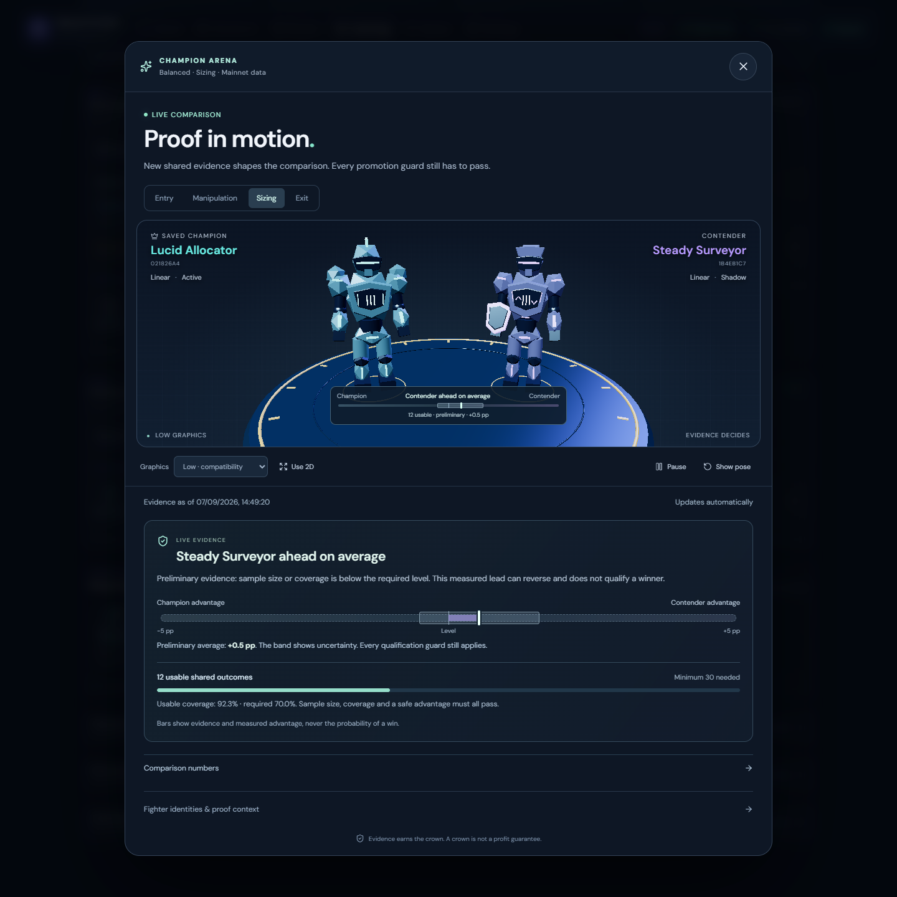

*Captured from the running v1.10.7 paper app on 7 September 2026. The bar shows measured
advantage and uncertainty, not win probability. Live evidence can change after capture.*

Additional views: [Reigning Champions](docs/screenshots/v1.10.7-live-2026-09-07/12-reigning-champions.png),
[recorded battle](docs/screenshots/v1.10.7-live-2026-09-07/13-recorded-battle.png)
and [Entry model profile](docs/screenshots/v1.10.7-live-2026-09-07/16-entry-profile.png).

## Reliability improvements inherited from v1.10.4

<details>
<summary><strong>Season continuity, evidence refresh and preserved safety gates</strong></summary>

- Auto new season finishes through a finite event boundary, even while new market events arrive.
  After the configured verified grace period, unresolved dormant inventory gets one persisted
  five-minute evidence window for the season. Verified losses preserve complete accounting;
  unresolved inventory is archived as unknown and makes the season non-comparable. An active
  position, pending order, Stop, unsafe market data or failed persistence still blocks rollover.
- Learning checkpoints rotate fairly between Policy and Discovery evidence. The optional reserve
  worker validates current on-chain accounts outside the trading decision path. It starts disabled;
  enable `SIGNAL_ARCADE_LEARNING_RESERVE_REFRESH_ENABLED=true` for a staged Shadow rollout after
  checking provider capacity. For the image-only Compose example below, add
  `SIGNAL_ARCADE_LEARNING_RESERVE_REFRESH_ENABLED: "true"` to the app service's `environment` block.
  Defaults allow one batch every 10 seconds, at most 20 routes and
  100 unique accounts. Provider backoff and market pressure can reduce that rate.
- Exit tournament scoring includes every required paired horizon. Training fits a private snapshot
  and publishes only if its season, configuration and authority context still match. Decision Lab
  outcomes require fresh executable reserves and their original fee budget. Dormant holdings alone
  no longer prevent the read-only Coach from running during quiet periods.
- Training models, artifacts and pending candidates commit together, so interrupted writes can retry
  without leaving a partial generation. Mainnet/Demo switches discard parked old-source events;
  cancelling batch collection releases its in-flight accounting.
- Champion history is paged and retained independently of heavy model payloads. Protected current
  and pending artifacts remain available; older payloads may be archived with their audit metadata.
  Status shows the terminal-evidence phase and warns when progress information is delayed.

These inherited v1.10.4 changes preserved the original 70% executable-outcome requirement,
unknown-outcome denominator and activation consent. v1.10.11 adds the optional native-skill
coverage setting described above. Sustained forward results are still needed
to establish useful Champions. They do not establish profitability. A prospective portfolio
experiment remains a separately versioned follow-on, as specified in the improvement plan.

See [Learning Lab](docs/LEARNING.md), [paper execution](docs/PAPER_EXECUTION.md), and the
[v1.10.4 verification record](docs/V1_10_4_VALIDATION.md) for details and rollout limits.

</details>

## 📸 See it in action

These screenshots use real live paper-app data captured on **7 September 2026** from the locally
running **v1.10.7** build. The [capture record](docs/screenshots/v1.10.7-live-2026-09-07/README.md)
identifies the images, viewports and capture method. Figures and warnings were not altered; each
view documents its capture time rather than a performance claim. All earlier screenshot folders
are preserved.

### The Arena

Paper equity, the season-locked risk profile, drawdown policy, unattended continuity, positions
and recent decisions stay together without hiding the assumptions behind the score.

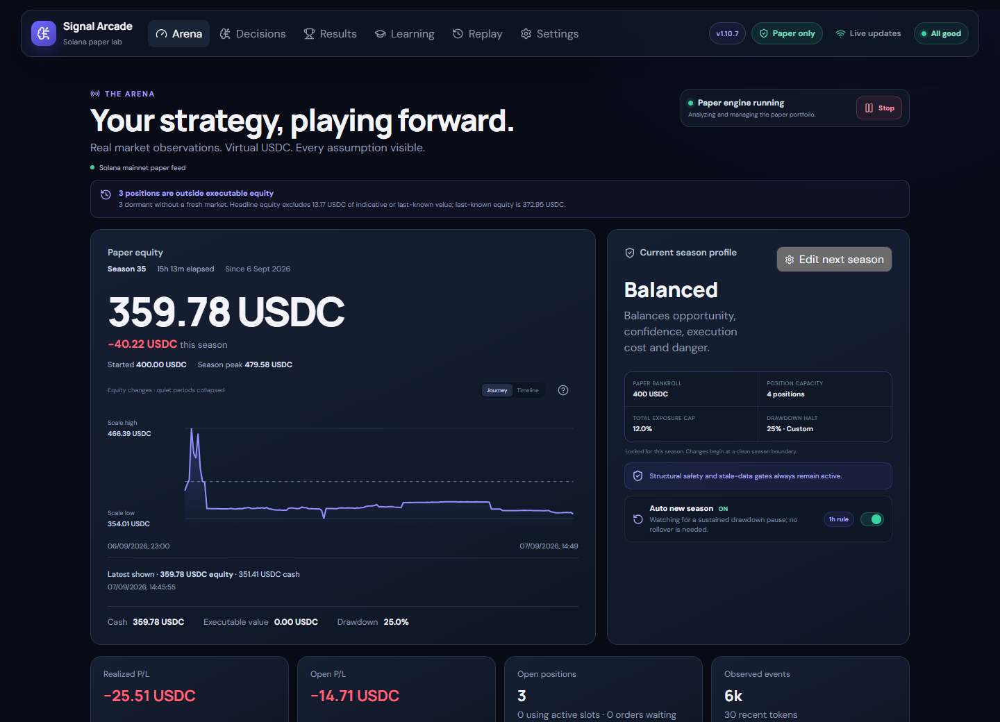

### Season progress

Compare win rate, drawdown, fees and net return across every retained paper season. Modern seasons
freeze their currency, starting bankroll, exact profile and accounting-boundary policy for
like-for-like filters; older history remains clearly labelled without unsupported claims.

Each scorecard's **Strategy used** section shows recorded Champion skills, learner or AI critic
support, and the first recorded use of each saved version. Shadow learning does not count as
influence. Older and partial histories stay labelled; current settings never rewrite past use.

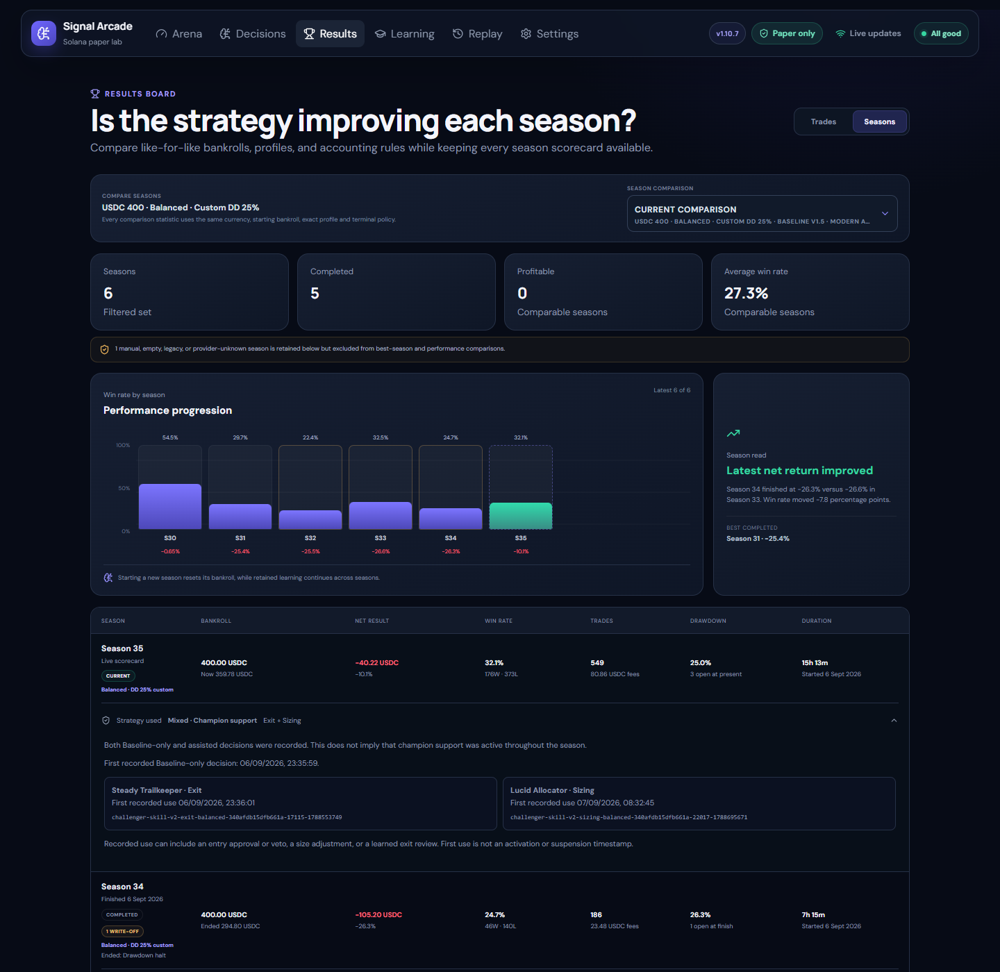

### Inspecting equity over time

Arena and Replay support hover, touch and keyboard inspection of saved equity and cash values.
Journey collapses quiet periods; Timeline preserves elapsed spacing. The saved season peak remains
separate from the displayed history, and older hourly closes are labelled as intervals.
Scale high and low are labelled beside the chart; the scale includes the starting bankroll.
The question-mark button opens chart guidance; the compact readout shows the latest displayed
checkpoint until you select another point.

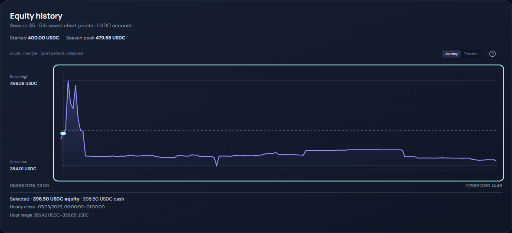

### Learning Lab and AI Coach Room

The deterministic Baseline remains responsible for entry approval and hard safety limits while
qualified Challenger skills can provide bounded support. Entry, Manipulation, Sizing and Exit
qualify independently; later contenders must challenge their saved Champions on common forward
evidence. The compact Learning view shows
Entry's exact-cohort Linear/XGBoost progress, current per-skill Champion reigns, and real recorded
battles with their shared sample, coverage and conservative result; detailed proof stays collapsed
until requested. Training progress is separate from Champion activation: support counts label the
sample minimum and coverage separately, with the observed total under artifact details.
The local AI Coach remains a separate researcher. **Allow when ready** saves permission for
future proved ideas to enter the matching Challenger skill automatically. Each idea must still
win a fresh Champion battle and pass activation checks, with automatic Champion support allowed,
before supporting Baseline.

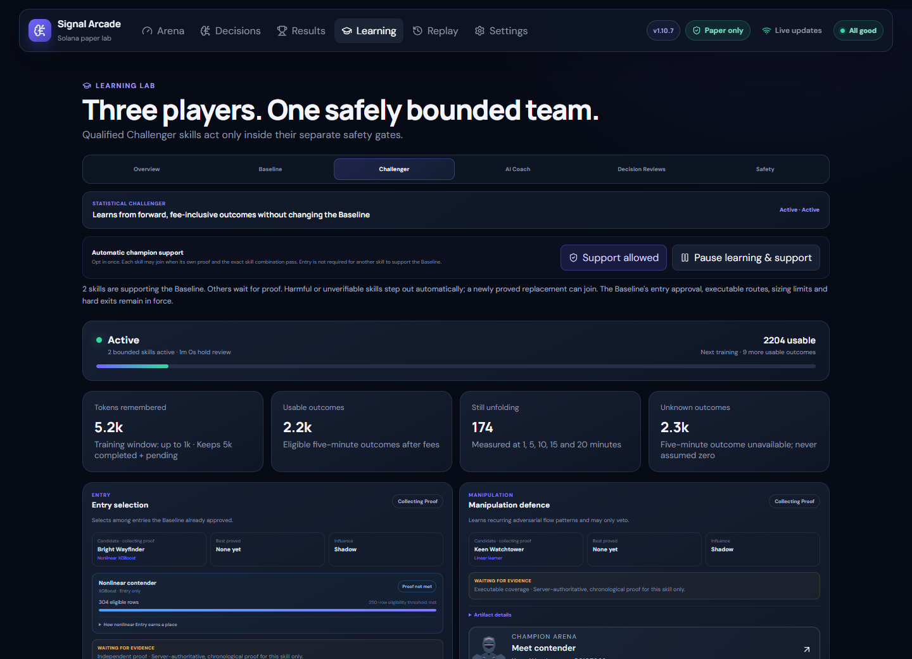

[View the four skill cards and their current proof](docs/screenshots/v1.10.7-live-2026-09-07/10-skill-progress.png).

<details>
<summary><strong>📷 More screenshots</strong></summary>

### Decision board

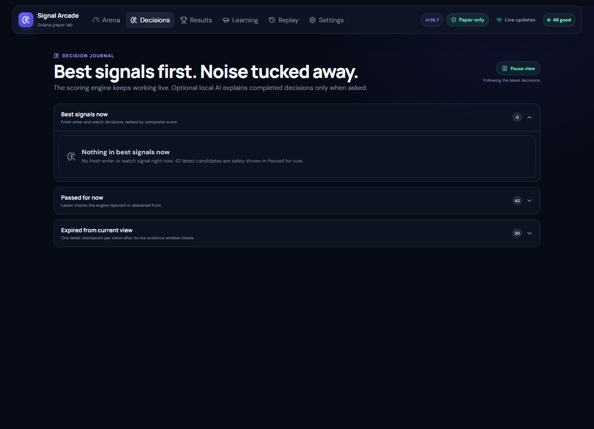

### Replay receipts and modeled friction

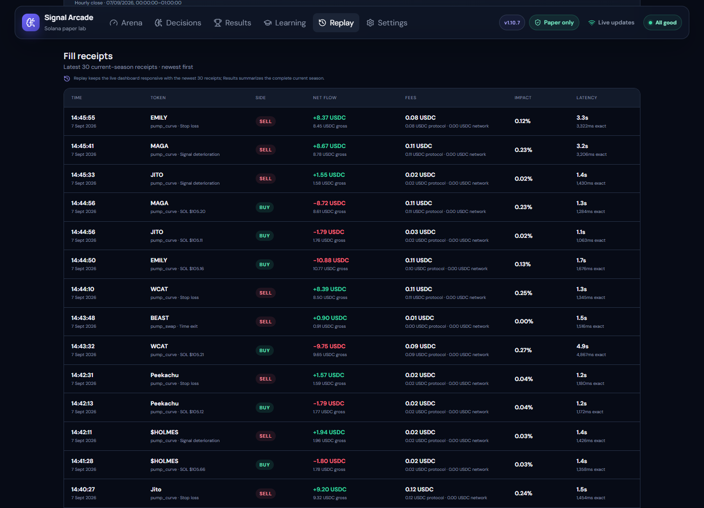

### AI Coach Room

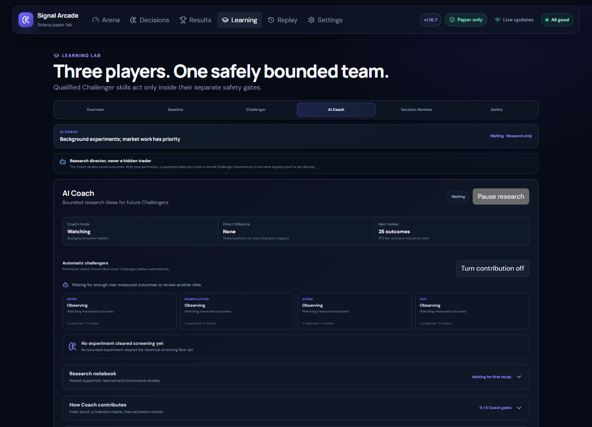

### Provider budgets and pacing

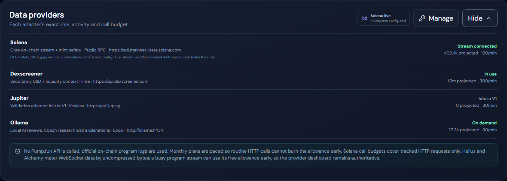

### Optional local AI models

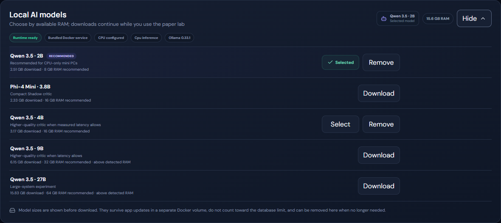

### Bounded diagnostics history

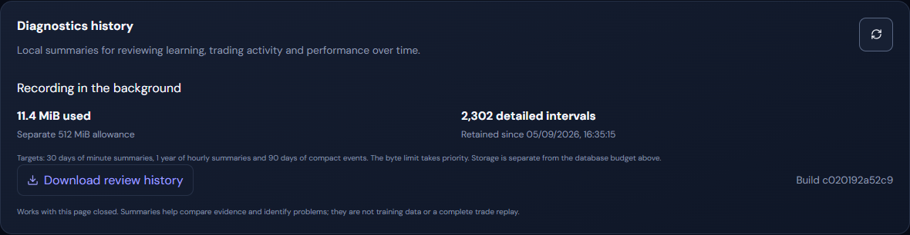

### Mobile layout

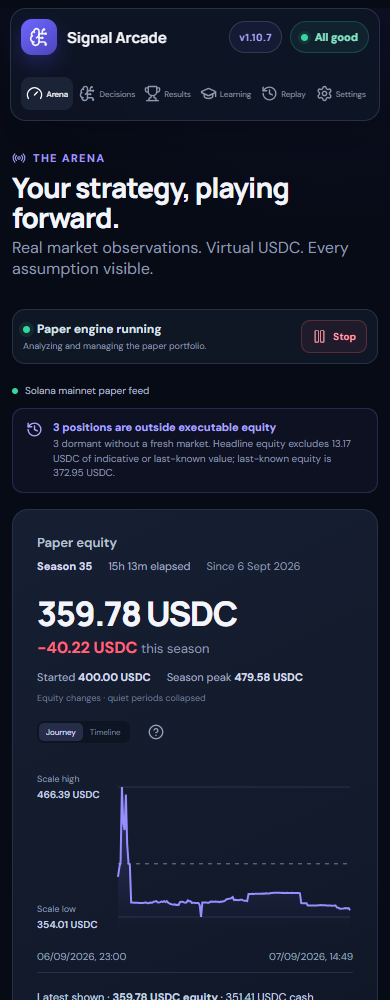

### Mobile Champion battle

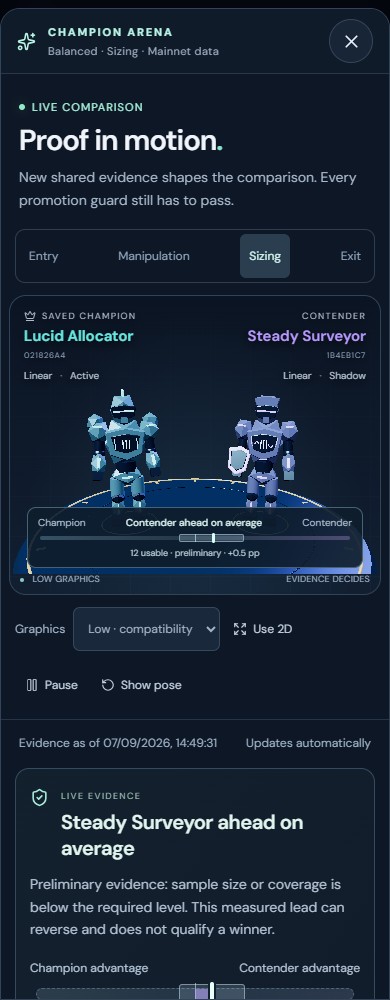

[View the mobile evidence and uncertainty readout](docs/screenshots/v1.10.7-live-2026-09-07/17-mobile-evidence.png).

</details>

---

## ⚡ At a glance

| Player | What it does | Influence in v1.10.11 |
|---|---|---|
| **Fast Baseline** | Scores fresh evidence, distinguishes economically meaningful flow from synthetic-looking activity, and sizes inside hard limits | Runs the paper portfolio |
| **Statistical Challenger** | Learns Entry, Manipulation, Sizing and Exit skills chronologically from fee-inclusive forward outcomes | Optional automatic support lets each qualified skill join after its own Baseline/composition proof; influence remains monitored and reversible |
| **Local AI Coach** | Rotates through bounded Entry, Manipulation, Sizing and Exit studies when the engine is quiet | Research only; a proved idea needs explicit permission and a fresh Challenger tournament before it could ever influence |

- 🛡️ **Corroborated integrity** — Baseline v1.5 combines wallet loops, net flow, coordinated trade
  structure, price-path evidence, economic trade size and meaningful wallet/volume participation
  without calling any one pattern a scam. An uninterrupted venue-local evidence window is
  authoritative: incomplete or shed candidate data waits instead of looking clean, while older
  locked seasons retain their exact policy.
- 🎮 **Comparable paper seasons** — Every new season locks one Safer, Balanced or Aggressive
  profile, a typed drawdown policy, currency and exact virtual bankroll. One next-season editor can
  change them together. Profile changes can finish safely or use a bounded end-now path; manual
  endings remain visible but never become strategy-performance claims.
- 🧠 **Explainable decisions and fills** — Opportunity, danger, confidence, execution, fees,
  impact and latency remain attached to the exact point-in-time evidence used. Every new receipt
  also freezes the precise reserve event and reserve values used by integer paper execution.
- 📚 **Learning must earn trust** — Linear remains the simple default; after enough evidence, a
  fixed single-thread CPU XGBoost Entry contender may compete only when it materially improves
  untouched validation. Each Challenger skill trains and validates chronologically with
  outcome embargoes, then a frozen candidate must beat the saved champion on the same later
  outcomes. Discovery can propose a contender, but only exact-cohort actionable policy episodes
  can qualify it; actual fills remain a separate execution audit. Qualified influence is bounded,
  versioned, auditable and suspended if health degrades.
  Unfamiliar Entry/Manipulation predictions leave Baseline in control and receive that same
  fallback value in comparisons. The XGBoost eligibility counter describes the latest completed
  Linear/XGBoost fit in the current context; it can decrease as the training window moves.
- 🔎 **Manipulation-aware decisions** — Wallet loops, gross-versus-net flow, trade structure and
  price paths require mature, independently corroborated evidence. A new entry waits for minimum
  integrity coverage, and an extreme isolated warning must resolve before the Baseline acts;
  raw point-in-time measurements remain available to the Challenger and Coach.
- 📐 **Auditable adaptive paper sizing** — Clean mature evidence may use more of realized bankroll,
  while moderate uncertainty receives a smaller exploratory amount, currently suspicious
  candidates are passed over, and cash, exposure, reservations and price impact remain hard limits.
- 🛡️ **Permanent safety boundaries** — A drawdown override changes only the portfolio halt. Stop,
  exposure, stale-data, mint, route and executable-exit protections remain active.
- 🔄 **Built for unattended runs** — Auto season rollover uses 1–24 hours of verified healthy,
  dormant evidence; brief source interruptions pause the clock instead of becoming proof.
- 📊 **Honest throughput status** — Processed, transient, saved, capacity-shed and expired events
  are shown separately, so high-volume in-memory work is not mistaken for lost market data. A
  per-token causal cursor prevents priority scheduling from reversing execution or learning time.
  Storage cleanup runs in small committed chunks, yields to protected market work and avoids
  routine full-journal counts, reducing contention with market processing.
  Settings shows when capacity and raw-history measurements were taken. Its live-data budget is
  a soft cleanup target: protected records, allocated/reusable pages and the WAL can exceed it.
  Raising this budget does not itself increase processing throughput or prove retention catch-up.
  Bounded age-based cleanup can proceed when capacity refresh is unavailable, while capacity-driven
  deletion still requires a fresh measurement. Unknown capacity never grants cleanup extra priority.
  Decision-history cleanup preserves its exact recent cohort and protected entries; its additive
  index is created on upgrade and preserved across season changes. Large existing histories may
  require additional startup time for that one-time index build.
  Browser saves preserve edits if another session changes the policy; refresh and review before
  retrying. A confirmed save schedules background work without waiting for cleanup to finish.
- 🔌 **Keyless and local by default** — Public Solana RPC and DEX Screener work without accounts;
  guided or custom providers and the private Ollama companion are optional. Helius Economy can
  reserve the key for paced HTTP safety lookups while retaining the default live stream.
- 📱 **Responsive and resilient** — Desktop and mobile views use live updates with automatic
  polling fallback, while persistent data and model volumes survive container updates.

---

## 🐳 Quick start with Docker Hub

Only Docker with Compose support and one admin password are required. Provider keys and local AI
models are optional and can be configured later from the web UI.

The example below pins the published v1.10.10 image. This checkout contains v1.10.11;
its public Docker Hub/GitHub release has not been published as part of this local update.
The target public tag is `nicxx2/signal-arcade:1.10.11`; it is not available from this local build.
Use a local source build for these changes until the versioned public image is available.

### 1. Create `.env`

```env
SIGNAL_ARCADE_ADMIN_PASSWORD=replace-this-with-a-long-unique-password
```

### 2. Save this as `docker-compose.yml`

```yaml
services:
  signal-arcade:
    image: nicxx2/signal-arcade:1.10.10
    pull_policy: always
    restart: unless-stopped
    stop_grace_period: 45s
    init: true
    environment:
      SIGNAL_ARCADE_ADMIN_PASSWORD: ${SIGNAL_ARCADE_ADMIN_PASSWORD:?Set a long admin password in .env}
      SIGNAL_ARCADE_OLLAMA_URL: http://ollama:11434
      SIGNAL_ARCADE_OLLAMA_ACCELERATOR: cpu
    extra_hosts:
      - "host.docker.internal:host-gateway"
    ports:
      - "8765:8765"
    volumes:
      - signal-arcade-data:/data
    read_only: true
    tmpfs:
      - /tmp:size=256m,noexec,nosuid
    security_opt:
      - no-new-privileges:true
    cap_drop:
      - ALL
    logging:
      driver: json-file
      options:
        max-size: "10m"
        max-file: "3"

  ollama:
    image: ollama/ollama:0.33.1
    pull_policy: always
    restart: unless-stopped
    init: true
    environment:
      OLLAMA_HOST: 0.0.0.0:11434
      OLLAMA_NO_CLOUD: "1"
      OLLAMA_CONTEXT_LENGTH: "2048"
      OLLAMA_KEEP_ALIVE: 10m
      OLLAMA_MAX_LOADED_MODELS: "1"
      OLLAMA_NUM_PARALLEL: "1"
      OLLAMA_MAX_QUEUE: "4"
      LLAMA_ARG_CACHE_RAM: "512"
      CUDA_VISIBLE_DEVICES: "-1"
      ROCR_VISIBLE_DEVICES: "-1"
    expose:
      - "11434"
    volumes:
      - signal-arcade-models:/root/.ollama
    security_opt:
      - no-new-privileges:true
    cap_drop:
      - ALL
    healthcheck:
      test: ["CMD", "ollama", "list"]
      interval: 30s
      timeout: 10s
      start_period: 20s
      retries: 5
    logging:
      driver: json-file
      options:
        max-size: "10m"
        max-file: "3"

volumes:
  signal-arcade-data:
  signal-arcade-models:
```

### 3. Start it

```bash
docker compose up -d
```

Open `http://localhost:8765`, or `http://server-ip:8765` from another device on your LAN. Use any
username and the password from `.env`.

On first use:

1. Choose a virtual SOL or USDC bankroll in **Arena**.
2. Select **Safer**, **Balanced** or **Aggressive**.
3. Press **Start paper engine**.
4. Optionally choose a local model under **Settings → Local AI models**.

### Updating

In **Settings → Maintenance & updates**, choose **Prepare for upgrade** and wait for **Ready**.
Signal Arcade finishes its current atomic paper action, preserves open positions and learning, and
shows the same commands below. It deliberately does not mount the Docker socket or control the host.

Change the image tag in `docker-compose.yml` to the newer published release, then run in that file's
folder:

```bash
docker compose pull
docker compose up -d
```

The named data and model volumes survive container updates. The prior paper-engine state resumes
after startup health checks, while an automatic-season countdown continues with its remaining time
rather than treating update downtime as market evidence. If preparation cannot finish, it restores
normal operation and reports the reason. Users who deliberately prefer a rolling tag can use
`nicxx2/signal-arcade:latest` instead.

After restart, new learning rows wait for five minutes of uninterrupted provider history.
Those rows then need their own five-minute outcomes before they can advance the retraining
counter; retained pending evidence may progress sooner. A running trainer can therefore be
correctly waiting for evidence. Check outcome progress and diagnostic timestamps rather than
expecting a new model immediately. See [learning continuity](docs/LEARNING.md#training-and-validation).

Upgrading an existing v1.9.2 or v1.10.x installation to v1.10.11 preserves the bankroll, open
positions, pending-order accounting, seasons, settings, learning evidence and Champion history in
the same data volume. For an upgrade from v1.10.6 or v1.10.7, Baseline stays on v1.5, existing learning
records remain available and no new paper season is required. Evidence selection enforces the
current contract and durable identity rules. Restarts revalidate current activation receipts;
older artifacts remain available for audit but cannot gain authority under a different feature schema.

**v1.10.11 retains schema 16.** Upgrading from published v1.10.7 through v1.10.10 adds no
evidence migration or reset. Contextual Exit timing introduced in v1.10.9 uses optional
position/order JSON, not a new table.
Existing positions use Baseline timing when a contextual Champion has no original saved plan.
The existing fixed timing family remains available.
An ongoing Entry/Manipulation comparison crossing v1.10.10's scoring correction starts a
partial replay; completed histories stay unchanged. Collection diagnostic counters begin a new
scope on restart without reconstructing older attempts or changing retained learning evidence.
The earlier v1.10.7 migration adds compact Policy identity records and fill indexes.
Retained evidence backfills known identities; already deleted pre-upgrade history cannot be
reconstructed. The identity ledger remains after larger evidence payloads expire and uses the main
data volume, separately from diagnostics. Its memory cache follows the retained evidence window;
the compact durable ledger grows with unique proof identities. Existing native Manipulation, Sizing
and Exit activation receipts remain subject to their normal context and health checks. Native Entry
needs the corrected ranking-validation contract; Coach crowns need a fresh activation receipt under
the corrected lifecycle.
The bounded per-season strategy-use sidecar preserves existing scores. Earlier participation is
labelled unknown or partial where no receipt
exists. Automatic Champion support defaults to disabled for installations without saved permission;
an existing saved preference is preserved. Browser graphics preferences stay local to each device.

If an older upgrade detects impossible retained fill timestamps, it preserves and labels that
season, stops the paper engine, excludes the result from ranking and learning, and asks for a clean
new season rather than rewriting history. Routine cleanup never deletes fills, ledger entries,
seasons or learning proof merely to satisfy a storage target.

**Back up before upgrading.** Migrations are forward-only. Keep a consistent SQLite backup or a
snapshot of the complete stopped data volume. Schema-15 images, including v1.10.6 and earlier local
v1.10.7 builds, cannot open schema 16; rollback requires restoring the matching pre-upgrade data and
image together. Published v1.10.4/v1.10.5 images use schema 14 and cannot open schema 15.
A v1.10.3 image also cannot open schema 14. Never copy only a running SQLite database file while
leaving its WAL behind.

v1.10.11 and published v1.10.7 through v1.10.10 use schema 16, but matching the database schema is
not sufficient for rollback. Once a changed Learning requirement has created versioned policy
records, use only a build that understands their saved proof and authority contracts. Returning
the setting to 70% does not remove that history. A compatible coverage-policy-aware build can
retain the current data volume; see [coverage transition rules](docs/LEARNING.md#configurable-skill-coverage-v11011).
After 55% has been saved or recorded in proof, the rollback build must also understand 55%.
Earlier builds accepting only 70/65/60 reject those records; switching the setting back does not
make their historical proof compatible. Do not rewrite saved proof to work around this restriction.
To return to an image predating those contracts, preserve the current data separately and restore
the matching pre-feature data and image together. Restoring an older backup loses newer evidence
from the active app; it is not a routine way to change the coverage setting.

Earlier builds also have independent limitations: v1.10.10 restores its probe-retention behaviour
and omits the new diagnostic detail; builds before it lack the new Coach forward-study fields
and restore the old Entry tie scoring. v1.10.9 restores its unsupported-veto scoring defect,
and releases before v1.10.9 do not implement contextual Exit plans. The versioned contextual
activation receipt cannot restore that authority on v1.10.8; existing Baseline safeguards remain.
Take a consistent backup before rollback and verify support and position state after changing
builds. Old builds may discard unknown optional plan fields when rewriting positions; upgrading
again cannot reconstruct those choices.

> Portainer users can paste the same Compose file into the Web editor and define
> `SIGNAL_ARCADE_ADMIN_PASSWORD` as a stack environment variable.

[Open the Docker Hub repository →](https://hub.docker.com/r/nicxx2/signal-arcade)

---

## 🧭 How the decision system works

```text
Official Solana program events
          ↓
Point-in-time feature snapshots
          ↓
Fast deterministic decision + structural gates
          ↓
Latency, fees and impact-aware paper execution
          ↓
Measured 1 / 5 / 10 / 15 / 20 minute outcomes
          ↓
Chronological challenger validation and AI Shadow coaching
```

The main engine does not wait for AI. It scores only saved market evidence and abstains when the
required route, mint state, reserves, conversion or freshness is unknown. Pending orders reserve
cash and position capacity before filling, and open positions remain supervised even during a
candidate burst.

Exits are deterministic too: stop loss, creator/mint safety, migration state, trailing profit,
signal deterioration and an absolute time ceiling remain bounded and visible. Strong fresh
evidence may extend a winner past its normal review point, but it cannot remove those hard gates.

<details>
<summary><strong>📚 Learning safeguards</strong></summary>

- Outcomes are measured after the decision at 1, 5, 10, 15 and 20 minutes.
- Fees, impact and exit availability are included; missing exits never become fake zero P/L.
- Entry, Manipulation, Sizing and Exit are independent versioned skills; one weak skill cannot earn
  another skill's permission.
- Training and validation remain chronological with embargoes to reduce look-ahead leakage.
- A candidate and current champion are frozen before a common-forward tournament; small, lucky or
  survivor-only cohorts cannot replace the champion.
- The Learning Lab durably keeps every recorded Champion milestone and referenced artifact while
  showing only a compact recent view; historical Champions remain valid without invented
  promotions or profit claims.
- **Allow when qualified** saves an explicit automatic-support preference. Entry is not required
  for Manipulation, Sizing or Exit to be first, but each needs its own qualification plus at least
  30 fresh usable outcomes, the applicable saved/current coverage requirement (70% by default),
  positive conservative value and the existing harm guard
  against the exact Baseline or skill combination it would join. Permission alone changes no trade.
- **Pause learning & support** stops new learning observations and Champion influence. Saved models
  and the automatic-support preference remain; already queued work may finish. Resume learning
  to continue. Turning automatic support off keeps learning in Shadow while removing influence.
- Restart restores only exact versions with valid activation receipts. A suspended version cannot
  silently reactivate; a newly proved replacement may join while permission remains enabled.
- Active skills continue monitoring later unseen outcomes. A degraded or unverifiable skill and
  every dependent downstream skill are suspended without weakening the Baseline.
- Unfinished forward horizons remain pending rather than counting as unavailable, and every
  retraining trigger stays inside the exact personality/configuration cohort that produced it.
- Champion proof and active-skill health use the authoritative Policy journal, so a later real
  entry after an earlier PASS remains valid without manufacturing another Discovery sample. Only
  one exact-cohort Policy trajectory per mint may contribute, and its Discovery twin is excluded
  from fitting so training and qualification evidence stay disjoint.
- Fitting runs only through one coalesced quiet-time worker; outcome safety, Champion health and
  common-forward tournament accounting remain immediate.
- Nonlinear artifacts use portable JSON with a bounded size and SHA-256 verification. Linear wins
  marginal family comparisons, and neither training order nor a missing/corrupt payload can create
  a Champion or influence.
- A proved Sizing multiplier applies only when that exact amount still fits all deterministic cash,
  exposure, reservation and route-impact limits; otherwise the valid Baseline size is preserved.
- Demo tokens can never train or activate the live-paper learner.
- Learning history persists across paper seasons and remains separated by risk personality.
- Default, custom and disabled drawdown experiments keep distinct season scorecards while sharing
  the same personality learning lineage; blocked opportunities are still recorded as
  non-actionable and cannot inflate Challenger proof.

See the full [Learning specification](https://github.com/Nicxx2/signal-arcade/blob/main/docs/LEARNING.md).

</details>

---

## 🤖 Local AI: optional, private and asynchronous

The bundled Ollama service is not published to the host or LAN. The default `qwen3.5:2b` model is
CPU-friendly, but no model is downloaded automatically. Signal Arcade remains fully functional
without Ollama.

- **Off** — automatic reviews and Coach research are paused. A requested decision explanation
  may still use the installed local model without altering the saved decision.
- **Shadow** — Decision Reviews are advisory and have no direct trading influence. Coach research
  has a separate path through Challenger tournaments.
- **Qualified Coach** — direct Coach control remains a future stage. It is separate from the
  research-to-Challenger contribution path already available in this release.
- **Live Critic** — remains a future stage and cannot be enabled in this release.

The Decision Reviews tab labels any persisted legacy **Guarded critic** mode separately: it may veto an entry after its own proof checks. Shadow reviews have no direct trading influence; switching to Shadow removes those legacy vetoes. The interface does not enable legacy Guarded mode.

The AI Coach Room is a separate research workflow and can be paused without disabling saved Shadow
decision reviews. It runs only when trading work is quiet, including during freshly verified
adaptive holds with enough time before the hard exit. An old hold label or a waiting exit cannot
grant that opportunity. Deterministic code creates a small
allowlist across Entry, Manipulation, Sizing and Exit; the model may select one candidate or none.
Historical evidence can reject or propose an idea, but only exact-cohort outcomes recorded after
that proposal can support it. The proof clock survives pruning and restart, while incompatible
Baseline, feature-schema, personality, provider/fee or active-Challenger contexts never mix.

A bounded study needs at least 60 usable forward outcomes, at least 70% executable coverage, two
independent seasons with at least ten usable outcomes each, and a confidence-adjusted improvement
above one percentage point. It closes honestly as rejected or inconclusive instead of collecting
forever. A supported idea still has zero direct authority. **Allow when ready** can be enabled
before any idea qualifies; permission persists across restarts without resuming paused research
or learning. Local AI Off pauses new handoffs; pausing research alone still allows already-proved
ideas to proceed when contribution permission is on. Turning contribution off stops new handoffs,
while existing contenders and Champions retain their normal rules. An idea waits for an existing
Champion in the matching skill, becomes a new contender, and must win a fresh common-forward
tournament before the Challenger can promote it. Active support still requires the separate
**Allow when qualified** permission in Learning → Challenger and current activation proof.

<details>
<summary><strong>⚡ Optional GPU acceleration</strong></summary>

CPU inference is the portable default. GPU access must be granted by Docker; changing an
environment label alone is not enough.

Download the matching overlay beside your Compose file:

- [NVIDIA overlay](https://raw.githubusercontent.com/Nicxx2/signal-arcade/main/compose.nvidia.yaml) — Linux or Docker Desktop/WSL2 with supported NVIDIA drivers/toolkit.
- [AMD ROCm overlay](https://raw.githubusercontent.com/Nicxx2/signal-arcade/main/compose.amd.yaml) — supported AMD GPUs on Linux.

Then start with both files:

```bash
# NVIDIA
docker compose -f docker-compose.yml -f compose.nvidia.yaml up -d

# AMD ROCm on Linux
docker compose -f docker-compose.yml -f compose.amd.yaml up -d
```

Settings reports runtime availability, the configured accelerator and actual CPU, GPU or hybrid
inference based on Ollama's loaded-model VRAM use. Models and learning data are preserved when
switching compute modes. macOS Docker and unsupported integrated GPUs remain CPU-only.

</details>

---

## 🔌 Data providers

The baseline requires no API key:

| Provider | Role | Default |
|---|---|---|
| Solana RPC | Official Pump/PumpSwap logs and mint safety | Public, keyless |
| DEX Screener | Separately timestamped USD/liquidity context | Keyless |
| Jupiter | Optional validation adapter; idle in V1 fills | Keyless configuration |
| Ollama | Explanations and Shadow coaching | Local and optional |

Under **Settings → Data providers**, users can select guided Helius, Alchemy or SolanaTracker RPC
presets, or enter custom HTTP/WebSocket endpoints and explicit free/paid limits. Keys are
write-only and never returned to the browser. **Helius Economy** uses keyed Helius HTTP for paced
mint/route safety lookups but restores the configured environment/public WebSocket for the
high-volume stream; the UI shows both routes and whether either is saved or default.

Monthly tracked-call caps are paced across the month, routine calls retain a reserve, and provider
`429 Retry-After` responses are honored. WebSocket bandwidth and provider-specific credits/CUs
remain visible only in the provider's own dashboard, so that dashboard is authoritative for paid
usage.

> For safety, secret values can be submitted only through `localhost` or HTTPS. A plain LAN URL can
> use every non-secret control, but provider keys should be added on the Docker host or through an
> HTTPS reverse proxy.

[Read the provider truth table →](https://github.com/Nicxx2/signal-arcade/blob/main/docs/PROVIDER_MATRIX.md)

---

## 🛡️ Paper-only boundary

V1 contains no wallet-key input, seed phrase handling, transaction signing or transaction
broadcasting path. Paper mode is not a visual label over live execution—it is the application
boundary.

Signal Arcade also:

- rejects a non-loopback native bind unless an admin password is configured;
- same-origin checks browser state changes;
- requires explicit confirmation for destructive season resets;
- stores provider secrets server-side and never sends their values back to the UI;
- fails closed on stale data, unverified migration routes, unsupported quote assets and unsafe or
  unknown mint structures;
- bounds Docker logs, raw market-event retention, diagnostics and optional AI work; durable
  trading and proof records can still grow and need host-disk monitoring.

---

## 🛠️ Build from source

<details>
<summary><strong>Docker source build</strong></summary>

```bash
git clone https://github.com/Nicxx2/signal-arcade.git
cd signal-arcade
cp .env.example .env
# Set SIGNAL_ARCADE_ADMIN_PASSWORD in .env
docker compose up --build -d
```

The repository's `compose.yaml` builds locally. The README quick-start stack and
`compose.image.yaml` pull the published Docker Hub image instead.

</details>

<details>
<summary><strong>Native development setup</strong></summary>

Requirements: Python 3.12+, Node.js 24+ and pnpm 11.

```bash
corepack enable
pnpm install --frozen-lockfile
pnpm --filter signal-arcade-web build

python -m venv .venv
# Windows: .venv\Scripts\activate
# Linux/macOS: source .venv/bin/activate
python -m pip install -e ".[dev]"

cp .env.example .env
signal-arcade
```

Open `http://127.0.0.1:8765`.

</details>

---

## ✅ Verification

```bash
python -m pytest
python -m ruff check backend tests
python -m ruff format --check backend tests
mypy backend/signal_arcade
pip-audit .
pnpm --filter signal-arcade-web lint
pnpm --filter signal-arcade-web test
pnpm --filter signal-arcade-web build
```

Technical documentation:

- [Architecture](https://github.com/Nicxx2/signal-arcade/blob/main/docs/ARCHITECTURE.md)
- [Decision model](https://github.com/Nicxx2/signal-arcade/blob/main/docs/DECISION_MODEL.md)
- [Learning](https://github.com/Nicxx2/signal-arcade/blob/main/docs/LEARNING.md)
- [Paper execution](https://github.com/Nicxx2/signal-arcade/blob/main/docs/PAPER_EXECUTION.md)
- [Changelog](https://github.com/Nicxx2/signal-arcade/blob/main/CHANGELOG.md)

---

## ⚠️ Important limitations

- v1.10.11 still needs monitoring under sustained market pressure. Candidate events can expire,
  diagnostic intervals can be delayed, and retention can temporarily fall behind; see the
  [runtime review](docs/V1_10_11_VALIDATION.md#six-hour-runtime-and-source-publication-review--25-september-2026).
- Paper results are not evidence that a strategy will be profitable live.
- Latency, MEV, failed transactions, RPC gaps and adversarial tokens can be worse than any paper
  model.
- V1 simulates native-SOL Pump curves and wrapped-SOL PumpSwap markets. USDC is an optional
  portfolio accounting currency, not support for USDC-quoted pools.
- Public RPC endpoints can throttle, disconnect or miss events; a private RPC can improve
  reliability but cannot promise uninterrupted coverage.
- Token-2022 mints with transfer-affecting or unreviewed extensions fail closed.
- Live trading belongs in a separately reviewed V2 and must not be introduced by weakening V1's
  paper-only boundary.

---

## 🤝 Community

Issues and pull requests are welcome. Please read the
[contribution guide](https://github.com/Nicxx2/signal-arcade/blob/main/CONTRIBUTING.md) and
[security policy](https://github.com/Nicxx2/signal-arcade/blob/main/SECURITY.md) first.

Signal Arcade is released under the [MIT License](https://github.com/Nicxx2/signal-arcade/blob/main/LICENSE).

*Paper-trading education only. Saved explanations and local AI experiments do not alter historical scores or constitute financial advice.*
